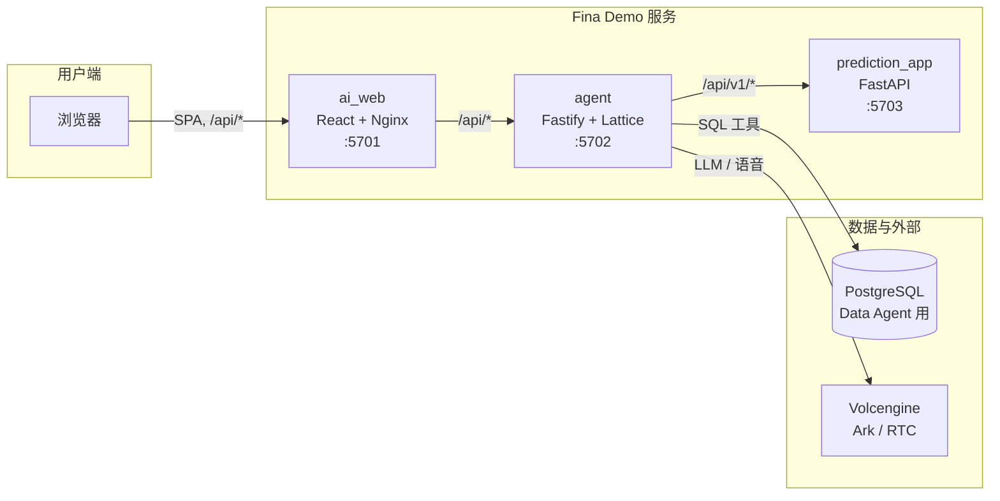
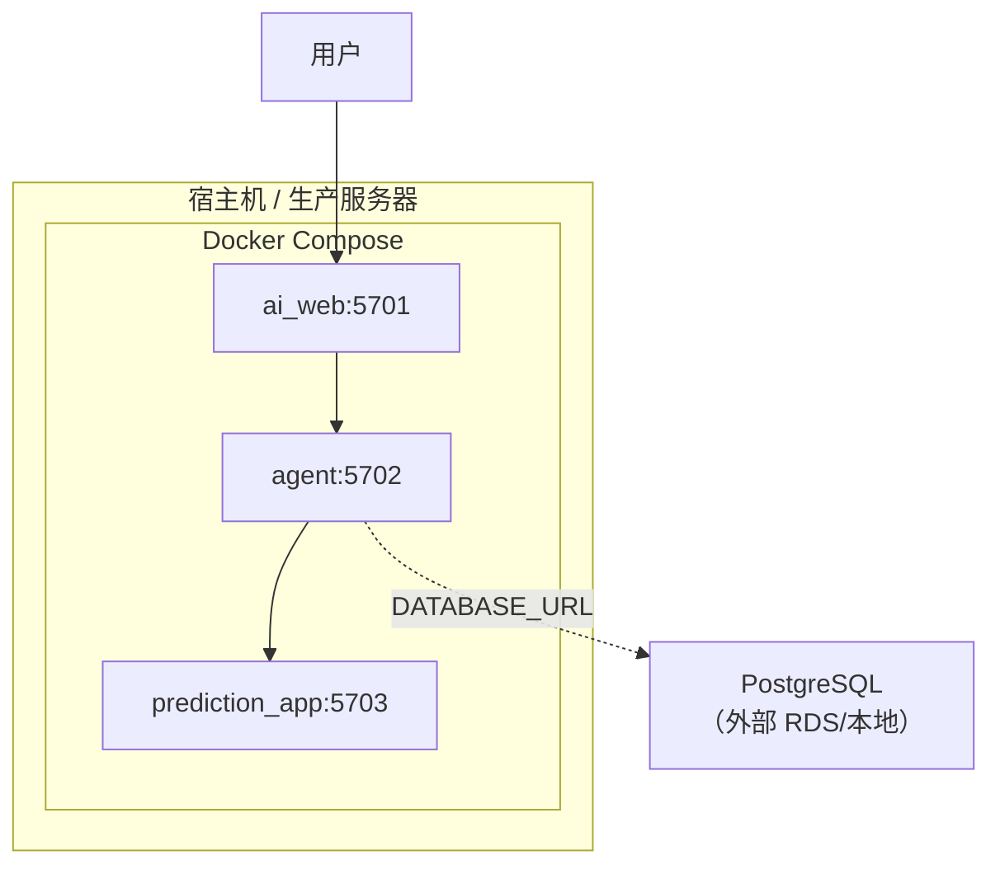
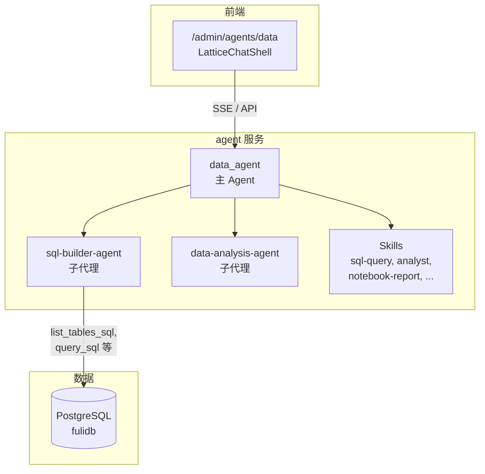

# Fina Demo 架构图

## 1. 系统总览

```
┌─────────────┐
│   用户/浏览器  │
└──────┬──────┘
       │ HTTP (SPA + /api/*)
       ▼
┌──────────────────────────────────────────────────────────────┐
│  ai_web (React + Nginx)  :5701                                │
│  • 静态资源 /admin/*                                           │
│  • /api/* → 反向代理到 agent                                    │
└──────┬───────────────────────────────────────────────────────┘
       │ /api/* (Lattice、/api/v1、/api/rtc、/api/files 等)
       ▼
┌──────────────────────────────────────────────────────────────┐
│  agent (Node.js Fastify + LatticeGateway)  :5702              │
│  • Lattice API（assistants/threads/runs/state）               │
│  • /api/v1/* → 反向代理到 prediction_app                       │
│  • /api/rtc/* 语音、/api/files 上传、/api/agents 等             │
│  • Data Agent / Research Agent / Voice Agent 等               │
└──────┬─────────────────────┬─────────────────────────────────┘
       │ /api/v1/*            │ DATABASE_URL (Data Agent SQL)
       ▼                     ▼
┌──────────────────┐   ┌─────────────┐      ┌────────────────────┐
│ prediction_app   │   │  PostgreSQL │      │ 外部 API（可选）     │
│ (Python FastAPI) │   │  (RDS/本地) │      │ • Volcengine Ark   │
│ :5703            │   └─────────────┘      │ • Volcengine RTC   │
│ • 数据集 CRUD     │                        │ • Coze Bot 等      │
│ • RFM/预测/库存   │                        └────────────────────┘
│ • 模型资产       │
└──────────────────┘
```

## 2. Mermaid 图（可在 GitLab/GitHub 或支持 Mermaid 的编辑器中渲染）

### 2.1 服务与请求流



### 2.2 部署视图（Docker Compose）



### 2.3 Data Agent 内部结构



## 3. 端口与路由速查（Docker 默认）

| 服务 | 容器端口 | 说明 |
|------|----------|------|
| ai_web | 5701 | 管理端入口，/admin/* 静态，/api/* 代理到 agent |
| agent | 5702 | 网关与 Agent，Lattice + /api/v1 代理 + /api/rtc 等 |
| prediction_app | 5703 | 数据集、RFM、销售预测、库存分配等 API |

请求路径约定：

- 浏览器只访问 **ai_web** 的同一域名；所有后端 API 通过 **/api/** 前缀由 ai_web 转发到 agent。
- agent 将 **/api/v1/** 转发到 prediction_app，其余 /api/* 由 agent 自身处理（Lattice、rtc、files、agents 等）。

## 4. 相关文档

- [文档索引](README.md)
- [开发 Data Agent](DEVELOPING_A_DATA_AGENT.md)
- [微服务、端口与路由](../MICROSERVICES_PORTS_AND_ROUTES.md)
