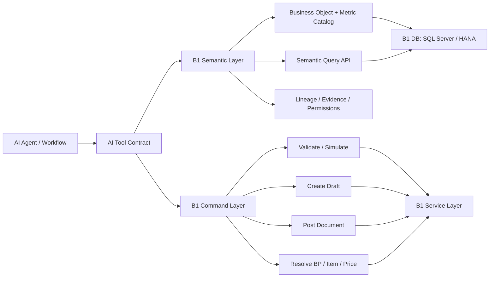

# B1 AI Semantic Layer and Service Layer Requirements

## Executive Summary

当前系统已经证明：SAP Business One 可以通过数据库直连和 Service Layer 被 AI 调用，但原生形态并不适合 AI 直接使用。

主要原因有三点：

1. **数据库模型过细、过物理化**：SBODemoUS SQL Server 当前至少有 2625 个基础表、90 个数据库 view。核心销售订单也需要理解 `ORDR` + `RDR1` + `OCRD` + `OITM` + `OSLP` + `OWHS` 等组合。
2. **Service Layer 是 OData 技术接口，不是业务语义接口**：XSM_ZSK metadata 已整理出 1099 个接口，其中 485 个 EntitySet、614 个 FunctionImport。接口数量大、命名偏技术、字段选择和 `$filter`/`$select`/session 细节对 AI 不友好。
3. **我们已经在应用侧补了一层 B1 semantic layer**：`b1s` 目前用 46 个逻辑 `VW_*`、7 个指标目录、SQL Server view translation、Service Layer session proxy 来屏蔽复杂度。这说明方向成立，但这层最好由 B1 产品/插件标准化提供，而不是每个 AI 项目重复建设。

建议向 B1 提需求时，不要只要求“开放更多表/接口”，而应要求提供两类面向 AI 的能力：

- **Semantic Layer for Read/Analytics**：稳定的业务对象、指标、维度、血缘、权限、查询 API。
- **AI-friendly Service Layer / CLI Layer for Actions**：围绕业务意图的命令化接口，例如 `create_draft_sales_order`、`find_business_partner`、`quote_item_price`、`validate_document_before_post`，隐藏 OData/session/字段细节。

## Current State Evidence

### B1 Database Shape

通过线上 `b1s` 对 SBODemoUS 的 SQL Server 采样：

| Item | Evidence |
| --- | --- |
| Table inventory | `INFORMATION_SCHEMA.TABLES` shows `BASE TABLE=2625`, `VIEW=90` |
| Sales order header rows | `ORDR = 1184` |
| Sales order line rows | `RDR1 = 5091` |
| Business partner rows | `OCRD = 25` |
| Item rows | `OITM = 71` |
| AR invoice header rows | `OINV = 1046` |
| AR invoice line rows | `INV1 = 3495` |

核心表字段抽样也显示典型 SAP B1 物理结构，例如 `INV1` 包含 `DocEntry`、`LineNum`、`BaseType`、`BaseEntry`、`ItemCode`、`Dscription`、`Quantity`、`Price`、`Currency`、`LineTotal`、`WhsCode`、`VatGroup` 等大量底层字段。AI 如果直接面对这些表，需要同时掌握表关系、字段语义、金额口径、业务状态、币种、税、单据流转关系和 SQL 方言。

### Current Metrics Server Design

旧 `metrics-server` 是 HANA-first 设计：

- master 配置库存 datasource 和 metrics meta。
- 每个 datasource 建一个 HikariCP pool。
- 查询 API 支持：
  - metrics catalog discovery
  - metric detail
  - semantic metric query
  - ad-hoc SQL
- 旧实现默认 HANA driver、HANA schema switch、HANA SQL，如 `TO_NVARCHAR(...)` 和 `LIMIT`。

`b1s` 基于这个设计改成 SQL Server-first：

- master PG 中 `t_datasource_config.instance_type = SQLSERVER` 区分 SQL Server datasource。
- `DynamicDataSourceManager` 只加载指定类型 datasource，并使用 SQL Server JDBC driver。
- `MetricsController` 对外暴露：
  - `GET /api/v1/datasources/{dsId}/metrics/index`
  - `GET /api/v1/datasources/{dsId}/metrics/{metricName}/detail`
  - `GET /api/v1/datasources/{dsId}/meta`
  - `POST /api/v1/metrics/query`
- 当前 catalog 有：
  - 46 个逻辑 `VW_*`
  - 7 个指标
  - 6 个业务 domain：`revenue_and_growth`、`sales_performance`、`fulfillment_and_logistics`、`quality_and_risk`、`customer_value`、`pricing_and_margin`

线上 query 已验证逻辑 SQL 可以转换成 SQL Server 物理 SQL：

```sql
-- logical SQL
SELECT
  TO_NVARCHAR("DocDate", 'YYYY-MM') AS "DocDate__month",
  SUM("GTotal") AS "order_amt_tax_inc"
FROM "VW_ORDR"
GROUP BY TO_NVARCHAR("DocDate", 'YYYY-MM')
LIMIT 5
```

会被转换成：

```sql
SELECT TOP 5 CONVERT(varchar(7), [DocDate], 120) AS [DocDate__month],
  SUM([GTotal]) AS [order_amt_tax_inc]
FROM (
  SELECT h.[DocEntry], h.[DocNum], h.[DocDate], h.[CardCode], h.[CardName],
         l.[LineNum], l.[ItemCode], l.[Dscription], l.[Quantity],
         l.[WhsCode] AS [WarehouseCode], l.[LineTotal] AS [GTotal],
         ...
  FROM [ORDR] h
  JOIN [RDR1] l ON h.[DocEntry] = l.[DocEntry]
  LEFT JOIN [OCRD] bp ON h.[CardCode] = bp.[CardCode]
  LEFT JOIN [OITM] i ON l.[ItemCode] = i.[ItemCode]
  ...
) AS [VW_ORDR]
GROUP BY CONVERT(varchar(7), [DocDate], 120)
```

这说明我们真正需要的是稳定的业务语义视图，而不是让 AI 直接拼 SAP B1 物理 SQL。

### Current B1 Service Layer Usage

`b1s` 当前实现了一个 Service Layer proxy：

- `POST/GET/... /b1s/v1/**` 转发到真实 B1 Service Layer。
- 用 header 选择账套：
  - `X-Company-DB`
  - `CompanyDB`
  - `Company-DB`
  - 默认 `SBODemoUS`
- 由服务端自动登录并缓存 session。
- 401/403 时丢弃 session 并重新登录。
- Service Layer base URL、账套、账号密码都通过环境变量配置。

Agent 侧目前又手写了一层小型 API index：

- `sap_api_search`：用手工维护的 `API_LIST` 搜索常见 EntitySet。
- `sap_api_call`：调用 Service Layer OData，并内置大量经验规则，例如：
  - 不直接用 `$expand`
  - 主键路径可能 500，优先用 `$filter`
  - GET 自动补 `$select` 和 `$top`
  - 清理 OData 噪音字段
  - 文档行只保留常用字段

这说明原生 Service Layer 虽然强大，但不够 AI-ready；AI 工具层需要额外维护大量“调用经验”和字段白名单。

## Problems To Raise To B1

### 1. Database Semantic Gap

AI 需要回答的是“销售额”“发货量”“客户信用风险”“库存可用量”“订单转化情况”，而数据库暴露的是 `ORDR`、`RDR1`、`OINV`、`INV1`、`OCRD`、`OITM` 等物理表。

当前缺口：

- 没有统一业务对象目录。
- 没有 header/line/detail 的标准展开口径。
- 没有指标定义、维度定义、同义词和业务说明。
- HANA 与 SQL Server 之间 SQL 方言不同，需要额外翻译。
- 不同客户可能有 UDF、UDT、addon 表，缺少标准发现和语义描述。

### 2. Service Layer Is Too Technical For AI Agents

AI 需要的是“创建销售订单草稿”“查找客户”“按客户和物料获取历史价格”“校验下单风险”，而 Service Layer 暴露的是 OData EntitySet、FunctionImport、字段和 session。

当前缺口：

- metadata 太大，XSM_ZSK 有 1099 个接口。
- 字段没有足够的业务必填/条件必填说明。
- 错误信息不够 action-oriented。
- session/login/route/cookie 细节需要调用方处理。
- OData 查询细节容易引起 400/500。
- 缺少面向业务动作的稳定 command schema。

### 3. AI Needs Explainable Validation, Not Only CRUD

以邮件采购/销售订单场景为例，AI 下单前需要解释：

- BP 是否存在，是否 frozen/valid。
- Item 是否存在，是否 sales/purchase item。
- UOM 是否匹配。
- 仓库是否可用。
- 价格来自价目表、特殊价格还是历史交易。
- PO 币种与 B1 价格币种是否一致。
- 交期、联系人、收货地址是否匹配。
- 是否需要人工复核。

这些不是单个 Service Layer CRUD 能直接完成的，需要 B1 提供业务校验和建议。

## Scenario Gap Review

下面用 10 个典型业务流程和 10 个分析场景反推当前 API 与 view/semantic API 是否充分。结论是：当前 `b1s` 的方向正确，但仍然偏“技术代理 + 本地补丁”；如果 B1 要真正支持 AI，需要把这些场景沉淀成稳定 command API、semantic view 和 metric API。

### 10 Business Process Scenarios: API Sufficiency

| # | Scenario | Current API Fit | Gap | Recommended Refactor / New API |
| ---: | --- | --- | --- | --- |
| 1 | 邮件/附件采购意向转销售订单草稿 | 部分可做。当前邮件监听可抽取附件并触发 Agent；Service Layer proxy 可创建 `Drafts`。 | Agent 仍需自己解析客户、物料、价格、联系人、地址、交期，并手拼 Drafts body。失败时只能靠 Service Layer 原始错误。 | 提供 `validate_sales_order_request` + `create_sales_order_draft`。输入自然业务字段，输出 resolved BP/item/price、warnings、draft payload 和可解释错误。 |
| 2 | 客户模糊匹配与去重 | 原生 `BusinessPartners?$filter=contains(...)` 可做，但调用者要懂 OData 和字段。 | 多候选、别名、税号、联系人、历史交易关系没有统一 ranking。 | 提供 `search_business_partner`，返回 candidates、matchScore、matchedFields、riskFlags。 |
| 3 | 物料模糊匹配、客户物料号、条码解析 | 原生 `Items`、`BarCodes`、可能还有客户物料映射表。 | AI 不知道应查哪些表/EntitySet，也不知道销售/采购/库存属性约束。 | 提供 `search_item`，支持 item name、foreign name、barcode、customer item code、model/spec，返回 sales/purchase/inventory flags。 |
| 4 | 客户 + 物料 + 数量 + 日期取适用价格 | 原生 `PriceLists`、`ItemPrices`、`SpecialPrices`、历史订单/发票都可查。 | “之前的价格”或“适用价格”需要多源优先级和解释；币种、税前税后、UOM 可能不一致。 | 提供 `resolve_price`，返回 price、currency、taxPolicy、source=`special_price|price_list|last_transaction|manual`、evidence document。 |
| 5 | 下单前业务校验 | Service Layer 创建时会报错，但通常太晚、太技术。 | 缺少 preflight：BP 有效性、信用、付款条款、库存、仓库、税码、地址、联系人、UOM、汇率。 | 提供 `validate_document` 或 `simulate_document`，不落单，只返回 blockingErrors、warnings、suggestedFixes。 |
| 6 | 草稿转正式单据/审批流 | 原生 `Drafts` 和文档接口可做。 | AI 不知道草稿状态、审批状态、可执行动作，也难以幂等。 | 提供 `explain_document_status`、`submit_draft`、`convert_draft_to_order`，支持 idempotency key 和下一步动作列表。 |
| 7 | 订单到交货到发票的单据链追踪 | 数据库可通过 Base/Target 字段查，Service Layer 也可查相关单据。 | 单据链跨 `ORDR/RDR1 -> ODLN/DLN1 -> OINV/INV1`，调用复杂且易错。 | 提供 `trace_document_flow`，输入 DocEntry/DocNum/NumAtCard，返回 order-delivery-invoice-return-credit memo lineage。 |
| 8 | 库存可用性和替代仓库建议 | `OITW`/库存相关 Service Layer 可查。 | Available = OnHand - IsCommited + OnOrder 口径、仓库权限、批次/序列号、交期都需解释。 | 提供 `check_inventory_availability`，返回可用库存、承诺量、在途量、替代仓库、shortage reason。 |
| 9 | 采购订单/供应商流程 | 原生 `PurchaseOrders`、`PurchaseDeliveryNotes`、`PurchaseInvoices` 可用。 | 供应商价格、最小起订量、交期、收货地址、采购 UOM 与销售 UOM 需要业务语义。 | 提供 `validate_purchase_order`、`create_purchase_order_draft`、`resolve_vendor_item_price`。 |
| 10 | 主数据创建/变更请求 | 原生 BP/Item CRUD 可做。 | 主数据字段多且有条件必填；AI 需要先生成待审批变更，而不是直接写入。 | 提供 `propose_master_data_change`，返回 diff、required approvals、validation result，再由人工/流程提交。 |

#### Business API Refactor Findings

1. **只代理 Service Layer 不够**：`/b1s/v1/**` 解决了登录/session，但没有解决业务意图、字段选择、校验和错误解释。
2. **需要 command layer 而不是更多 EntitySet wrapper**：AI 最稳定的调用面应是 command schema，例如 `search_item`、`resolve_price`、`validate_document`、`create_draft`。
3. **写操作必须 split 成 validate/simulate + create/submit**：AI 先拿到可解释校验结果，再决定自动创建、人工复核或要求补充信息。
4. **每个 command 要返回 evidence**：例如 price evidence、BP match evidence、inventory evidence、document lineage evidence，方便 AI 给用户解释。
5. **错误要领域化**：从 OData/SQL/Service Layer 原始错误，提升为 `BP_NOT_FOUND`、`ITEM_AMBIGUOUS`、`CURRENCY_MISMATCH`、`INSUFFICIENT_STOCK`、`CONTACT_NOT_FOUND` 等。

### 10 Analytics Scenarios: View / Semantic API Sufficiency

| # | Analysis Scenario | Current `VW_*` / Metrics Fit | Gap | Recommended View or Semantic API |
| ---: | --- | --- | --- | --- |
| 1 | 月度销售订单金额、客户/物料/销售员拆分 | 当前 `VW_ORDR` + `order_amt_tax_inc` 可支撑基础聚合。 | 金额口径只用 `LineTotal`/`GTotal` 简化，税前税后、币种、取消/关闭状态、open amount 口径不足。 | 重建 `SalesOrderLine` semantic view，明确 gross/net/tax/local/foreign currency、open/closed/cancelled filters。 |
| 2 | 订单到交货到开票转化漏斗 | 当前有 `VW_ORDR`、`VW_ODLN`、`VW_OINV`，但分散。 | 缺少单据链 view，无法直接分析订单行是否交货、是否开票、周期多久。 | 新建 `VW_DOCUMENT_FLOW` 或 semantic API `document_flow_metrics`，统一 Base/Target lineage。 |
| 3 | 客户复购、客单价、生命周期价值 | `avg_ticket_size_per_customer` 基础可做。 | 缺少 customer lifecycle、first/last order date、cohort、active/inactive、信用/应收风险联合分析。 | 新建 `VW_CUSTOMER_360`，或提供 `customer_metrics` semantic API。 |
| 4 | 价格纪律：价目表、特殊价、历史价偏差 | 当前 `VW_ITM1`、`VW_OSPP`、订单/发票 line 可查。 | 缺少统一 price evidence view；无法直接比较实际成交价 vs price list vs special price vs last price。 | 新建 `VW_PRICE_RESOLUTION` / `VW_PRICE_VARIANCE`，支持按 BP/item/date/quantity 查来源和偏差。 |
| 5 | 毛利分析 | 当前 `VW_SalesRevenueCost` 存在但语义不明，`VW_JOURNAL_ENTRY` 可辅助。 | 成本来源、发票收入、退货/贷项、期间、币种、科目映射需要标准口径。 | 重建 `VW_MARGIN_LINE`，定义 revenue/cost/gross_margin/gross_margin_rate 及 source lineage。 |
| 6 | 库存可用、周转、呆滞料 | 当前 `VW_STOCK` 和 `VW_OIVL` 可支撑部分。 | 缺少库存年龄、最近出入库日期、承诺订单、在途采购、替代仓库、批次/序列号。 | 扩展 `VW_INVENTORY_POSITION` 和 `VW_INVENTORY_MOVEMENT_AGING`；提供 `inventory_health_metrics`。 |
| 7 | 采购履约：PO 到收货到 AP invoice | 当前 `VW_OPOR`、`VW_OPDN`、`VW_OPCH` 可查。 | 缺少采购单据链、供应商交期、收货差异、未收/未票。 | 新建 `VW_PURCHASE_FLOW`，提供 `purchase_fulfillment_metrics`。 |
| 8 | 应收/应付、信用风险、账龄 | 当前有 `VW_CUSTBAL`、`VW_CUSTCREDIT`、`VW_DEALBAL`、`VW_DEALCREDIT`。 | 需要标准 aging buckets、信用额度占用、逾期天数、未清单据明细和销售订单/交货占用。 | 重建 `VW_AR_AGING`、`VW_AP_AGING`、`VW_CREDIT_EXPOSURE`，字段口径和 buckets 固定。 |
| 9 | 生产订单进度、用料、完工、差异 | 当前有 `VW_OWOR`、`VW_OWORDetail`、`VW_BOM_LIST`。 | 生产领料/入库/报废/工序/成本差异未形成端到端 view。 | 新建 `VW_PRODUCTION_FLOW` 和 `VW_PRODUCTION_VARIANCE`；semantic API 支持 by work order。 |
| 10 | 异常检测：退货、折扣、信用、库存、价格异常 | 当前单指标分散，AI 可拼但不稳定。 | 缺少统一 anomaly fact view 和 threshold metadata；AI 需要知道“异常”的业务定义。 | 提供 `anomaly_candidates` semantic API，基于可配置 rules/thresholds 返回异常、解释和关联单据。 |

#### Analytics / Semantic Layer Refactor Findings

1. **当前 46 个 `VW_*` 多是物理表的轻包装**：它们有价值，但还不是完整业务事实模型。销售、采购、库存、财务需要按 fact/dimension 重组。
2. **最需要优先重建的是 flow views**：`VW_DOCUMENT_FLOW`、`VW_PURCHASE_FLOW`、`VW_PRODUCTION_FLOW`。AI 分析经常问“从 A 到 B 发生了什么”，这不是单个 header/line view 能回答的。
3. **价格和毛利需要独立 semantic model**：价格来源、币种、税、成本口径如果不标准化，AI 很容易给出错误结论。
4. **应收/信用和库存需要可行动字段**：不只是余额/库存数量，还要有 overdue bucket、available-to-promise、blocked reason、next action。
5. **不要只提供 view，也要提供 semantic API**：对跨对象、带口径、带权限、带 warning 的查询，直接 view 不够，应提供 `/semantic/query`、`/semantic/explain`、`/semantic/lineage`。

### Priority Additions From Scenario Review

基于以上 20 个场景，优先级应调整为：

1. **先做 command API 的 5 个核心命令**：`search_business_partner`、`search_item`、`resolve_price`、`validate_document`、`create_draft`。
2. **先做 semantic layer 的 6 个核心事实模型**：`SalesOrderLine`、`DocumentFlow`、`Customer360`、`PriceResolution`、`InventoryPosition`、`AR/AP Aging`。
3. **把所有 API 返回统一成 evidence-bearing response**：数据、置信度、warnings、source lineage、recommended next actions。
4. **保留 raw Service Layer 和 custom SQL，但从 AI 默认工具中降级**：只作为 escape hatch，不作为第一调用面。

## Target Architecture



目标不是替代 Service Layer，而是在 Service Layer 上方提供 AI 更稳定的契约。

### Layer 1: Business Object Catalog

B1 应提供标准业务对象目录，例如：

| Object | Physical Sources | Required Semantic Shape |
| --- | --- | --- |
| `SalesOrder` | `ORDR` + `RDR1` | header + lines + customer + item + warehouse + status |
| `Delivery` | `ODLN` + `DLN1` | shipment lines, warehouse, delivery status |
| `ARInvoice` | `OINV` + `INV1` | invoice lines, tax, settlement status |
| `BusinessPartner` | `OCRD` + related BP tables | customer/vendor profile, credit, payment terms, addresses, contacts |
| `Item` | `OITM` + `ITM1` + warehouse info | item master, UOM, price list, inventory |
| `Inventory` | `OITW` + movements | stock, committed, ordered, available |

每个对象应有机器可读 metadata：

```json
{
  "object": "SalesOrder",
  "version": "1.0",
  "source": {
    "sqlServer": ["ORDR", "RDR1", "OCRD", "OITM", "OWHS"],
    "hana": ["ORDR", "RDR1", "OCRD", "OITM", "OWHS"],
    "serviceLayer": "Orders"
  },
  "fields": [
    {
      "name": "DocDate",
      "type": "date",
      "label": "Posting Date",
      "required": true,
      "filterable": true,
      "groupable": true
    },
    {
      "name": "GTotal",
      "type": "numeric",
      "label": "Line Amount",
      "currencyField": "Currency",
      "aggregations": ["sum", "avg"]
    }
  ],
  "relations": [
    {
      "from": "SalesOrder.CardCode",
      "to": "BusinessPartner.CardCode"
    },
    {
      "from": "SalesOrder.lines.ItemCode",
      "to": "Item.ItemCode"
    }
  ],
  "permissions": {
    "readScopes": ["sales.read"],
    "writeScopes": ["sales.write"]
  }
}
```

### Layer 2: Metric Catalog

B1 应提供或支持客户配置一套标准 metric catalog，而不是只暴露 SQL。

指标 metadata 至少包括：

- `metric_name`
- `display_name`
- `domain`
- `description`
- `calculation`
- `source_object`
- `supported_dimensions`
- `default_time_context`
- `filters`
- `synonyms`
- `business_caveats`
- `currency_policy`
- `evidence_sql` 或 lineage

示例：

```json
{
  "metric_name": "order_amount",
  "display_name": "Sales Order Amount",
  "source_object": "SalesOrder",
  "calculation": {
    "aggregation": "sum",
    "field": "GTotal"
  },
  "supported_dimensions": [
    {"dim_id": "customer", "field_name": "CardName"},
    {"dim_id": "item", "field_name": "ItemCode"},
    {"dim_id": "warehouse", "field_name": "WarehouseCode"},
    {"dim_id": "salesperson", "field_name": "SlpName"}
  ],
  "default_time_context": {
    "time_dimension": "DocDate",
    "supported_grains": ["day", "week", "month", "year"]
  }
}
```

### Layer 3: Semantic Query API

当前 `b1s` 的 `/api/v1/metrics/query` 是一个可工作的雏形。B1 可以产品化成标准接口：

```json
{
  "companyDb": "SBODemoUS",
  "object": "SalesOrder",
  "metrics": ["order_amount"],
  "groupBy": ["DocDate__month", "customer"],
  "filters": [
    {
      "dimension": "DocDate",
      "operator": "BETWEEN",
      "values": ["2026-01-01", "2026-05-31"]
    }
  ],
  "limit": 100
}
```

返回必须包含：

- columns
- rows
- semantic object / metric name
- applied filters
- lineage / generated SQL / source tables
- warnings，例如币种未转换、字段缺失、权限裁剪

### Layer 4: AI-friendly Command Layer

建议 B1 在 Service Layer 上方提供 command-style API 或 CLI schema。重点不是把 OData 包一层，而是提供面向业务任务的“意图接口”。

#### Recommended Commands

| Command | Purpose |
| --- | --- |
| `search_business_partner` | 按名称、税号、电话、别名模糊查 BP，并返回可解释匹配 |
| `search_item` | 按物料名、客户物料号、条码、型号查 item |
| `get_customer_item_price` | 给定 BP、item、数量、日期，返回适用价格及来源 |
| `validate_sales_order` | 创建前校验客户、物料、价格、库存、税、地址、联系人 |
| `create_sales_order_draft` | 创建销售订单草稿 |
| `create_purchase_order_draft` | 创建采购订单草稿 |
| `convert_draft_to_order` | 草稿转正式单据 |
| `explain_document_status` | 解释单据状态和下一步可做动作 |

#### Example: Validate Then Create Draft

```json
{
  "command": "validate_sales_order",
  "companyDb": "SBODemoUS",
  "input": {
    "customerName": "Mashina Corporation",
    "lines": [
      {
        "itemName": "J.B. Officeprint 1420",
        "quantity": 24,
        "pricePolicy": "previous_price"
      }
    ],
    "requestedDeliveryDate": "2026-06-15"
  }
}
```

Expected response:

```json
{
  "ok": false,
  "confidence": 0.82,
  "resolved": {
    "CardCode": "C20000",
    "CardName": "Mashina Corporation",
    "lines": [
      {
        "ItemCode": "A00001",
        "ItemName": "J.B. Officeprint 1420",
        "Quantity": 24,
        "UnitPrice": 123.45,
        "Currency": "USD",
        "priceSource": "last_transaction"
      }
    ]
  },
  "warnings": [
    {
      "code": "CONTACT_NOT_FOUND",
      "message": "Requested contact person was not found in BP master."
    },
    {
      "code": "CURRENCY_MISMATCH",
      "message": "PO currency differs from B1 price currency. No conversion applied."
    }
  ],
  "nextActions": [
    "create_draft",
    "request_human_review"
  ]
}
```

### Layer 5: Runtime and Governance

B1 should own or standardize:

- session handling
- company DB selection
- auth scopes
- rate limiting
- idempotency key
- audit trail
- validation evidence
- error taxonomy
- command versioning
- schema export for tool-calling systems

## What We Should Ask B1 To Provide

### Priority 1: Official Semantic Read Model

Request:

- Official, documented SQL/HANA-compatible semantic views for common B1 objects.
- Stable names such as `VW_SalesOrderLine`, `VW_ARInvoiceLine`, `VW_BusinessPartner`, `VW_Item`, `VW_Inventory`.
- Header/line joins already resolved.
- Common display fields included.
- UDF and UDT discovery included.
- Per-view metadata endpoint with fields, types, labels, relations and version.

Acceptance criteria:

- AI can answer common analytics questions without knowing `ORDR/RDR1/OCRD/OITM` joins.
- Same logical query can run on HANA and SQL Server.
- B1 publishes breaking-change/version policy.

### Priority 2: Official Metric and Dimension Catalog

Request:

- Standard catalog for sales, purchasing, inventory, AR/AP, production and finance metrics.
- Machine-readable metric definition.
- Supported group-by/filter dimensions.
- Currency/tax/net/gross policies.
- Drill-down lineage to source documents.

Acceptance criteria:

- Agents can discover metrics before querying.
- Query API rejects unsupported dimensions with actionable messages.
- Results include provenance and warnings.

### Priority 3: AI Command API / CLI Layer

Request:

- Business commands above OData, with JSON schemas suitable for LLM tool calling.
- Commands for BP/item lookup, price lookup, document validation, draft creation and posting.
- Built-in validation and explainable warnings.
- Idempotency keys.
- Structured error codes.

Acceptance criteria:

- AI can create a sales order draft without manually selecting OData EntitySet fields.
- If input is ambiguous, API returns candidates and required clarification fields.
- API can simulate/validate before writing.

### Priority 4: Metadata Compression For AI

Request:

- Do not expose only huge `$metadata`.
- Provide filtered metadata packs by domain:
  - sales
  - purchasing
  - inventory
  - finance
  - production
  - master data
- Provide examples and safe default `$select` field sets.

Acceptance criteria:

- A tool can fetch `GET /ai/metadata/sales` and receive a compact schema under a predictable token budget.
- Each field has label, type, requiredness, allowed operations and examples.

### Priority 5: Operational Robustness

Request:

- Service-side session pooling.
- Health endpoint for Service Layer login and company DB availability.
- Timeouts and retry guidance.
- Clear separation between read-only query APIs and write APIs.

Acceptance criteria:

- Client does not manage `B1SESSION`/`ROUTEID` cookies directly.
- Login timeout and session expiry are reported as structured errors.
- Read APIs and write commands have separate auth scopes.

## Migration Plan For Our Current System

### Phase 0: Keep Current `b1s` As Compatibility Gateway

Keep:

- `b1s` on port 5705.
- `X-Company-DB` support.
- SQL Server datasource config in master PG.
- Current `/api/v1/metrics/*` API.
- Current `/b1s/v1/**` proxy.

Improve short-term:

- Move default DB credentials out of `application.yml` defaults.
- Add structured error codes for Service Layer login timeout.
- Add `/api/v1/b1/health?companyDb=...`.
- Add idempotency key support for write workflows.
- Disable unrestricted `customSql` for untrusted users, or scope it behind admin auth.

### Phase 1: Formalize Our Semantic Model

Turn current files into a versioned internal contract:

- `meta/table-catalog.json`
- `meta/view-translations.json`
- `meta/metrics-index-meta.json`
- `meta/metrics-detail-meta.json`
- `meta/VW_*.csv`

Add:

- object-level schema JSON
- relation graph
- field aliases/synonyms
- currency and tax policy
- SQL Server/HANA dialect abstraction
- test fixtures for all 46 `VW_*`

### Phase 2: Add Command Layer In `b1s`

Add endpoints:

- `POST /api/v1/commands/search-business-partner`
- `POST /api/v1/commands/search-item`
- `POST /api/v1/commands/quote-price`
- `POST /api/v1/commands/validate-sales-order`
- `POST /api/v1/commands/create-draft`

These endpoints should internally use Service Layer and SQL semantic views, but expose clean command schemas to AI.

### Phase 3: Replace Custom Logic With B1-provided Standard Capabilities

When B1 provides official semantic views or command APIs:

- Map our `VW_*` names to B1 official object names.
- Deprecate local view translation where official views exist.
- Keep local extension mechanism only for customer UDF/UDT and addon tables.
- Keep our Agent workflow and document/email processing, but remove SAP-specific field guessing.

## Proposed Requirement Text To Send To B1

We need SAP Business One to provide an AI-ready semantic and command layer, not only raw database access and the generic OData Service Layer.

For analytics/read use cases, please provide a stable semantic layer over core B1 business objects. It should expose documented objects such as SalesOrderLine, DeliveryLine, ARInvoiceLine, BusinessPartner, Item, Inventory, PurchaseOrderLine, JournalEntryLine, etc. Each object should include field metadata, labels, data types, relations, supported filters/group-bys, currency/tax semantics, source table lineage, versioning and permission scopes. The same logical contract should work across HANA and SQL Server so clients do not need to implement dialect-specific view translation.

For action/write use cases, please provide an AI-friendly command API or CLI-style schema above Service Layer. Commands should include business partner lookup, item lookup, customer-specific price lookup, document validation, draft creation, posting, and document status explanation. These commands should hide session cookies, OData query syntax and low-level field selection, and return structured validation warnings, candidates for ambiguous matches, idempotency support, and actionable error codes.

The expected outcome is that an AI agent can discover available business objects and metrics, ask semantic queries, validate a proposed sales or purchase document, create a draft, and explain failures without memorizing SAP physical tables, OData quirks, or customer-specific UDF conventions.

## Open Questions For B1

1. Can B1 publish official semantic views for both HANA and SQL Server, or only metadata that partners generate into views?
2. Can UDF/UDT/addon metadata be exported with business labels and domain grouping?
3. Can Service Layer provide compact domain metadata packs for AI tools instead of only full `$metadata`?
4. Can B1 provide a validation/simulation endpoint before document creation?
5. Can B1 provide a price resolution endpoint that explains whether price came from special price, price list, last transaction or manual override?
6. Can B1 provide stable structured error codes for common document creation failures?
7. Can B1 support idempotency keys for AI-driven write actions?

## Appendix: Current Implementation References

- Service Layer proxy: `b1s/src/main/java/com/fina/b1s/b1/B1ProxyController.java`
- Session cache/login: `b1s/src/main/java/com/fina/b1s/b1/B1SessionManager.java`
- SQL Server datasource loading: `b1s/src/main/java/com/fina/b1s/config/DynamicDataSourceManager.java`
- Metrics discovery/query API: `b1s/src/main/java/com/fina/b1s/controller/MetricsController.java`
- Semantic query execution: `b1s/src/main/java/com/fina/b1s/service/impl/MetricsServiceImpl.java`
- Logical view translation: `b1s/src/main/java/com/fina/b1s/service/impl/ViewTranslationServiceImpl.java`
- B1 logical view catalog: `b1s/src/main/resources/meta/view-translations.json`
- Metrics catalog: `b1s/src/main/resources/meta/metrics-index-meta.json`, `b1s/src/main/resources/meta/metrics-detail-meta.json`
- Agent-side Service Layer tool shim: `agent/src/agents/sap_b1/tools.ts`
- Local Service Layer interface extraction: `agent/src/agents/sap_b1/XSM_ZSK_metadata_interfaces.md`
