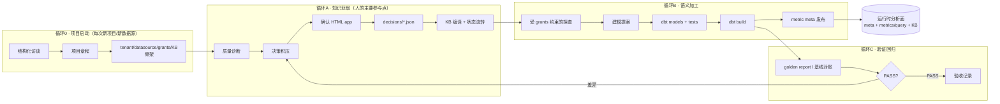
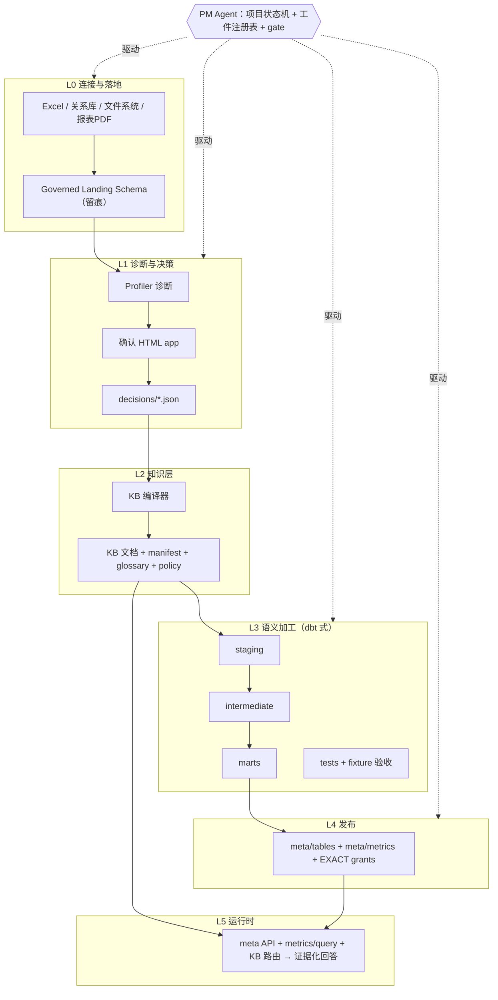

# Agentic Semantic Factory：方法论与目标架构

- 状态：draft v0.1（供评审）
- 日期：2026-09-04
- 来源：Hankel Run for Gold 实践复盘 + 后续架构讨论
- 后续细化（2026-09-05，设计建议）：[架构 v0.2](./architecture-v0.2.md)、[决策与发布协议](./contracts-and-release-protocol.md)、[试点与验收计划](./pilot-and-validation-plan.md)。包含对本文部分假设的修订，尚未实施。
- AI-native BI 增补（2026-09-05）：[已验证分析库、问题评测与建模 Copilot](./verified-analysis-and-copilot-design.md)，吸收 Snowflake VQR、Databricks Genie benchmarks 与 dbt Copilot/Wizard 的机制，并补充运行时版本和问题级验收；仍为设计。
- 相关文档：[B1 AI Semantic Layer Target Architecture](../../B1_AI_SEMANTIC_LAYER_TARGET_ARCHITECTURE.md)、[Hankel Run for Gold Semantic Assets](../../../metrics-server/docs/hankel-run-for-gold-semantic-assets.md)、[Hankel Metrics KB](../../../metrics-server/docs/hankel-metrics-kb/README.md)、[Agentic CDP Draft](../agentic-cdp/README.md)、[安全设计笔记](./security-notes.md)、[dbt 动态部署](./dbt-dynamic-deploy.md)、[清洗放哪：ETL vs SQL](./etl-vs-sql-cleaning.md)、[业务自助的边界](./self-service-boundary.md)、[竞品对照](./competitive-landscape.md)、**[评审简报（供外部 AI 分析）](./review-briefing.md)**

## 0. 一句话

把"从原始数据到可信业务洞察"的全过程，工程化为一条**有工件、有验收、有确认门**的语义资产生产线：agent 执行环节，人在门口确认，知识持续复利；每个新项目从同一条生产线上过，而不是每次重新发明。

Hankel Run for Gold 证明了这条线可以人工走通一遍；本架构的目标是让它可以由 agent 走通第 N 遍。

## 1. 方法论：一个总循环，四个子循环

原始七环节（数据质量诊断 → rawdata 导入 → datasource 探查 → calculation view → 指标建立 → 口径知识化 → 分析洞察）不是一条直线，而是四个循环加一个常开面：



要点：

- **循环 A 是知识从哪来的答案**。诊断不只是找脏数据，更是发现"口径空白"——每一轮人机确认都让语义层知识变厚一层。
- **循环 B 是逻辑放在哪的答案**。复杂逻辑全部在 dbt 分层模型里，运行时 metric meta 保持 SQL-free。
- **循环 C 是凭什么可信的答案**。golden report 只做验收不做事实源，对账差异是诊断信号而非被抹掉的噪音。
- **运行时是常开面**，只依赖 meta API、metric query、KB 路由三样东西。

Hankel 已完整人工走通过一次循环 A（Sell-in 全量 1,656,594,630.73 → 客户确认白名单规则 → view 实现 → 2026-09-04 复测 1,607,161,170.43 PASS），agent 化就是把每一棒自动化。

## 2. 第一性原则

| # | 原则 | 内容 | 反面（要防的） |
|---|---|---|---|
| P1 | 工件化 | 每个环节产出结构化工件（报告、提案、决策、对账），可版本、可追溯，不是聊天记录 | 口径只存在于会议和 IM 里 |
| P2 | 确认门 | 不可逆、高成本、对外的事情必须 human gate；确认通过"决策捕获装置"落地为 `decisions/*.json` | agent 自行把 draft 当 confirmed |
| P3 | 状态机 | 资产有 `business_status`（7 态），项目有生命周期（8 态）；一切行为受状态约束 | "已发布"被当成"已确认" |
| P4 | 权限分层 | builder 走 grants + 受治理探查；运行时只见 meta + metric query；raw 物理表不对运行时暴露 | 知识库描述被当成数据访问授权 |
| P5 | 对账自证 | 每个建模步骤配验收；对账保持 diagnostic，差异要披露不要抹零 | 强行让 QA 视图归零 |
| P6 | 知识分层 | 方法论模板（跨项目）与项目实例（单客户）分开；实例可回流模板 | 第二个项目从零开始 |
| P7 | 落地统一 | 一切源（Excel/DB/文件/报表）先落 governed landing schema，dbt 只引用落地区 | 下游感知异构数据源 |
| P8 | 运行时无 SQL | 复杂逻辑在 view/model，metric meta 只有聚合与比率定义 | agent 裸拼物理 SQL |
| P9 | 溯源留痕 | 落地行保留 source_file/sheet/row；回答必带 asOf、口径状态、质量说明 | 无法回答"这个数哪来的" |
| P10 | 隐私边界 | 销售人名、终端客户明细只实时按需读取，不进持久化 KB/报告/日志 | 聚合分析里夹带明细 |
| P11 | Landing 后只 SQL | 数据一旦落地，一切"数据→数据"的变换只有 SQL（dbt）一条通道；staging/marts 的生产者只有 dbt，任何非 SQL 逻辑只能以"新落地源"身份重新进入，不得插入变换链 | Python/脚本在链路中段清洗数据 |

## 3. 目标架构：六层 + 横切



| 层 | 职责 | 关键工件 | 现有对应物（已存在的部件） |
|---|---|---|---|
| L0 连接与落地 | 异构源统一落地，schema 推断、类型规范化、溯源 | 导入回执、landing 表 + source 列 | `prediction_app/config/datasets.json`、datasource 注册、`tmp/hankel_*_import`、document_service |
| L1 诊断与决策 | 质量诊断、口径空白识别、人机确认 | 质量报告、决策积压、确认 app、`decisions/*.json` | KB05 质量规则表、`evidence/responses/*.json`、`evidence/decisions/*.json` |
| L2 知识层 | 口径知识化、状态机、证据优先级 | KB 六件套 + `manifest.json`、glossary、agent-policy | `metrics-server/docs/hankel-metrics-kb/` |
| L3 语义加工 | staging/intermediate/marts 分层建模 + tests + 血缘 | dbt 项目、schema.yml、tests、lineage manifest | `scripts/hankel/run-for-gold-views.sql`（待迁移）、QA reconciliation view |
| L4 发布 | SQL-free metric meta、grants 收敛、发布预览 | metric detail/index、EXACT grants | `publish-run-for-gold-meta.sh` 等 3 个脚本、`meta/tables`、`meta/metrics` |
| L5 运行时 | 只读问答、口径消歧、证据化回答 | 回答证据 JSON（metric/asOf/口径状态/质量说明） | `GET /datasources/15/meta`、`POST /metrics/query`、KB 文档路由 |
| 横切 项目编排 | 生命周期状态机、gate 调度、工件注册、多项目并行 | 项目 manifest（章程） | `tmp/hankel_tenant_setup`（手工版） |

## 4. 两个状态机

### 4.1 项目生命周期

```
onboarded → data_landed → diagnosed → scope_confirmed
→ modeled → published → verified → live → (新一轮扩展循环)
```

| 迁移 | Gate | 门的形式 |
|---|---|---|
| onboarded → data_landed | 章程确认（tenant/datasource/grants 配置） | 确认 app |
| data_landed → diagnosed | 质量报告产出且决策积压建立 | 工件存在性 + 抽检 |
| diagnosed → scope_confirmed | 口径决策确认 | 确认 app（人） |
| scope_confirmed → modeled | dbt build 全绿 | 自动（CI） |
| modeled → published | 发布预览确认（meta + grants diff） | 确认 app（人） |
| published → verified | 对账 PASS 或差异已披露 | 自动 + 人复核 |
| verified → live | 运行时冒烟（KB 路由 + 证据回答抽检） | 人 |

### 4.2 资产状态机 `business_status`（沿用 Hankel 七态）

`customer_confirmed` / `customer_confirmed_semantic_foundation` / `written_spec_reference` / `pending_business_confirmation` / `demo_quality` / `technical_diagnostic` / `demo_fixed_parameters`

规则：状态只能经确认门流转；runtime 回答必须携带状态；runtime 与客户口径不一致时报告差异，禁止改知识库迁就 SQL。

## 5. Agent 编制

| Agent | 所属循环 | 输入 | 产出工件 | 工具面 | Gate |
|---|---|---|---|---|---|
| Bootstrap/PM | C0 + 全程 | 访谈答案 | 项目章程、manifest、租户/datasource/骨架 | tenant setup 工具（包装自 `hankel_tenant_setup`） | 章程确认 |
| Profiler | A | landing 表 | 质量报告、决策积压 | 只读探查 | — |
| 确认 app（装置，非 agent） | A | 决策积压 | `decisions/*.json` | 静态页 + 回传 | **人** |
| Curator | A | decisions + ontology + 客户答复 | KB 草稿、状态流转 | KB 编译器 | 知识审阅（人） |
| Explorer | B | grants + landing | 建模范围提案、粒度/匹配键建议 | `table-grants`、governed `query` | 提案确认 |
| Modeler | B | 提案 + decisions | dbt models + tests（强制成对） | `dbt build` | build 全绿（自动） |
| Publisher | B | marts | metric meta + grants | `meta/tables`、`meta/metrics` | 发布预览确认 |
| Reconciler | C | golden report / 基线 | 对账报告 | verify SQL | PASS 或差异披露 |
| Analysis | 运行时 | 用户自然语言问题 | 证据化回答 | meta + metrics/query + KB 路由 | — |

人只出现在三类位置：确认 app 上的业务/客户确认、知识审阅、验收复核。其余由 agent + 自动 gate 驱动。

## 6. 知识体系：模板与实例

```
knowledge/
├── templates/                     # 方法论模板（跨项目复用、复利回流）
│   ├── quality-rules/             # 空值/重复/无效ID/单位/异常金额处理
│   ├── answer-contract/           # 证据回答结构、消歧流程
│   ├── evidence-priority/         # 证据优先级规则
│   └── industry/                  # 行业模式（如快消经销商三事实）
└── projects/<project>/            # 项目实例（单客户）
    ├── manifest.json              # 项目章程：租户/数据源/角色/阶段/gate记录
    ├── decisions/*.json           # 确认决策（id/scope/status/version/rationale）
    ├── kb/                        # 编译产物：六件套 + manifest
    └── ontology/                  # 客户提供的源资料
```

回流机制：某项目的 confirmed 决策若被判定为行业通用模式，经审核晋升为模板（带出处链接）。检验标准：**第二个项目的启动与建模时间应是第一个的零头**。

## 7. 最小入手路径

| 步骤 | 内容 | 验收标准 |
|---|---|---|
| M1 | 项目 manifest schema + bootstrap 工具（包装 `hankel_tenant_setup`）。具体设计见 [m1-bootstrap-design.md](./m1-bootstrap-design.md) | 用它 onboard 一个空测试项目，产出章程 + 租户/骨架；幂等重跑无副作用 |
| M2 | 决策确认 app + decisions schema + KB 编译器 | 第一批积压 = KB05 的 11 条待确认项；app 勾选 → decisions JSON → KB 重生成、`business_status` 流转 |
| M3 | dbt 迁移 `run-for-gold-views.sql` | 14 个 view 成 model + test 成对；golden report 做 fixture 验收；build 全绿；publish 脚本改消费 dbt artifact；参数改 run-scoped |
| M4 | Excel → landing 通道 | 一个多 sheet Excel 落地并带 source_file/sheet/row 溯源；Profiler 能出质量报告 |

**总验收**：用 agentic_cdp 数据充当"第二个客户"，在 M1–M4 工具链上完整 onboard 一次，人工介入只出现在 gate 上。

顺序建议：M1 → M2 优先（没有项目容器和知识获取循环，其余产出无家可归）；M3、M4 可并行。

## 8. 反模式红线

1. 知识库迁就当前 SQL（KB 明令禁止，必须报告"runtime 与口径不一致"）。
2. 把 `draft`/`pending` 描述为客户已确认。
3. Model 不配 test 就合入。
4. 运行时暴露 raw 物理表或 `customSql`。
5. 聚合报告/持久化日志夹带销售人名、终端客户明细。
6. 参数硬编码在 view 里（YTD Aug 2026 问题的教训：必须 run-scoped）。
7. 把确认 app 做成展示页而非决策捕获装置。

## 9. 开放问题（已有建议方案，展开见 [open-questions-recommendations.md](./open-questions-recommendations.md)）

1. dbt 还是自研加工层？→ **建议直接用 dbt-core 起步**：护城河在知识循环不在 SQL runner，且 dbt 模式对 LLM agent 最友好。
2. 确认 app 形态？→ **双轨同源**：对外纯静态页 + decisions.json 回传，对内走 gateway；M2 只做静态页，不做带登录的 Web 应用。
3. 追溯粒度？→ **L1/L2（决策↔资产集合）第一天强制，L3 列级自动血缘只做 CI 警告、渐进收紧**。
4. run-scoped 参数？→ **业务参数进配置表（参数是数据），工程参数用 dbt vars（参数是代码）**；materialization job 暂不做；新建 run 本身是一条决策。
5. 多租户 KB 隔离？→ **collection=tenant 强绑定 + manifest linter + 禁止跨租户引用**；绝不复制 metrics v1 的弱租户回退。
6. 模板回流审核？→ **两条硬性晋升标准 + KB owner 一票审批 + git PR 流**；初期宁滥勿缺，瓶颈是没人沉淀而非不够精。
7. Dashboard 20 指标？→ **定为 M5 压力测试**，用工厂自身指标（人工介入次数、gate 耗时、缺陷捕获点、自动生成率）量化验收；Won YTD 与 Competition 窗口共存正好检验 Q4。
