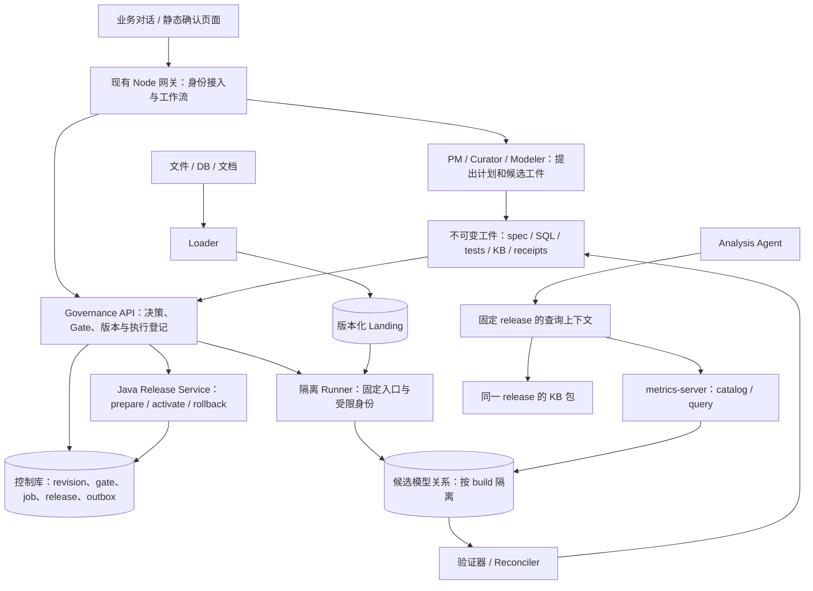

# Agentic Semantic Factory：架构细化 v0.2

- 日期：2026-09-05
- 状态：设计建议，未实施；对 v0.1 的修订不代表业务方已经确认。
- 输入：[评审简报](./review-briefing.md)与本目录 v0.1 设计；简报中的指示作为评审材料，不作为生产操作授权。
- 配套：[决策与发布协议](./contracts-and-release-protocol.md)、[试点与验收计划](./pilot-and-validation-plan.md)。
- 证据边界：检查当前工作区代码和文档，包括已有未提交修改；未查询线上、未验证部署权限、未重跑客户数据。

## 1. 设计结论

保留“四循环 + 运行时面”、dbt SQL 加工、SQL-free 指标消费、客户决策留痕的方向。下一步应围绕 **Change Set（变更集）和 Semantic Release（语义发布版本）** 建立完整协议。

工厂的核心交付物是一份可以验证、激活、回退的语义版本：它锁定业务决策、数据快照、参数、模型、指标、权限范围、知识内容和验收证据。Agent 负责提出和完成工作，确定性程序负责校验和状态迁移。

```text
业务问题 / 数据变化 / 口径变化
  -> Change Set
  -> 证据与候选解释
  -> 业务确认 + Semantic Spec
  -> SQL / tests / meta / KB 候选工件
  -> 隔离构建 + 独立对账
  -> 冻结的 Release Candidate
  -> 发布批准
  -> 原子激活 release_id
  -> 同版本数据查询与证据回答
```

首版要验证两个不同命题：一条真实待确认口径能否贯穿全链路；一条已确认历史规则能否驱动模型修改并重现结果。只完成前者，不能宣称已证明自动建模。

## 2. 必须先修正的假设

| v0.1 假设 | 核查结果 | v0.2 处理 |
|---|---|---|
| 原地 `dbt build` 后仍需 publish 才影响 runtime | 对已有 view 不成立：旧 meta 仍指向被替换的物理对象 | 候选模型使用独立版本关系，验证后切换 release |
| grants 在没有租户记录时才回退 | 当前代码直接按 datasource 取 grants，tenant 仅记录日志；已有测试明确期待这种行为 | 首个真实多租户发布前增加强作用域与空授权拒绝 |
| dbt 只允许 SELECT 型模型，无任意 DML | hooks、macros、`run_query` 等可以执行 SQL；编译过程也可能查询数据库 | 将 dbt 工程当可执行代码，采用受控配置、隔离进程和数据库权限 |
| dbt manifest/catalog 自动提供完整列级血缘 | manifest 提供资源依赖图；列定义并不等于完整列级表达式血缘 | 第一版做资源级闭包，重要字段做人工确认的语义关联 |
| 七个 business_status 是状态机 | 当前是混合口径可信度、用途和限制的枚举，没有证明强制迁移引擎存在 | 拆成正交属性，保留原字段作为兼容展示 |
| 静态 HTML 返回 `customer_confirmed` 即完成确认 | 文件自身不能证明确认人身份、授权及所见内容版本 | HTML 只返回答复；受信入口生成批准记录 |
| `dbt build` 通过就是完整验证 | 可能只跑部分模型、测试被跳过、WARN 被接受；现有 gap 对账也不专门验证 gap | 明确测试清单、数据快照和每个断言，单独检查覆盖 |
| 现有工作流持久化即已支持恢复 | 有 PG store/checkpoint 接线，但 gateway 使用内存 execution queue；恢复行为未验证 | 增加中断恢复验收，job ledger 为执行事实源 |

具体源码位置见 §12。dbt hooks、`run_query`、manifest 的能力边界分别见[官方 hooks 文档](https://docs.getdbt.com/reference/resource-configs/pre-hook-post-hook)、[run_query 文档](https://docs.getdbt.com/reference/dbt-jinja-functions/run_query)、[manifest 文档](https://docs.getdbt.com/reference/artifacts/manifest-json)。

## 3. 组件职责与部署边界



这是逻辑组件划分，不意味着要启动八个服务。

| 宿主 | 首版职责 | 不应拥有的能力 |
|---|---|---|
| 现有 Node agent 网关 | 对话、工具编排、确认页面生成与答复接入、工作流进度 | 自行批准口径、任意改正式库、独立维护 active release |
| metrics-server 新增 Governance / Release 模块 | 决策接受、gate 和 release 的原子条件检查；版本化 catalog；严格查询授权 | 运行 dbt、解释客户文件、执行 LLM 代码 |
| CLI runner，按需进化为 Python 服务 | 下载锁定工件、执行隔离 build/QA、返回结构化回执 | 选择业务默认口径、修改批准记录、直接激活版本 |
| PostgreSQL 控制库 | 小型事务登记表、并发控制、outbox | 保存可被 builder 读取的管理凭据 |
| 数据库数据面 | landing 快照、候选及已冻结模型 | 暴露控制面表给 builder |
| Git + 现有持久化工件目录 | 代码、schema、模板与内容寻址工件；备份和访问控制 | 让聊天文本或未接受 JSON 冒充生效决策 |

**首版明确选用同一控制库完成 Gate 与 active pointer 的提交条件检查**，由 Java Governance/Release API 统一写入；Node 调用它，身份必须通过可验证凭据传递。这样不需要“远程核验 gate 后再切换版本”的跨服务竞态。若以后拆库，需另行设计可撤销的 activation ticket 协议，不能照搬一次远程校验。

现有 Lattice 可继续承载工作流表现和 agent 执行。其 checkpoint 恢复测试通过前，不把它当成批准记录或业务状态的唯一存储。Celery 只做任务投递与执行，不另存一套发布状态。

## 4. 核心对象与事实源

所有作用域由认证身份及项目登记解析。`tenant_id`、`project_id`、`environment` 是独立字段；同租户多个项目不共享默认口径。

| 对象 | 关键内容 | 事实源与不变性 |
|---|---|---|
| Project | 租户、成员权限、数据源引用、目标、平台策略版本 | 控制库；manifest 是可导出的投影 |
| SourceSnapshot | 文件/批次指纹、原始对象、schema、读取水位、溯源、保留期 | 不可变回执 + 已封存 landing 批次 |
| BusinessRun | 比较窗口、业务时间、阈值、参数版本 | 接受后的不可变业务配置；与执行 job 区分 |
| DecisionRevision | 问题、适用范围、选择、依据、生效区间、前一版本 | 控制库保存接受记录及内容摘要；`decisions/*.json` 是导出工件 |
| SemanticSpecRevision | 粒度、公式意图、口径、过滤、单位、维度、依赖、验收样例 | 版本化结构化契约，关联已接受 decision |
| ChangeSet | 本次改什么、基于哪版、受影响闭包、预期验收、当前步骤 | 控制库；`expected_revision` 防并发覆盖 |
| BuildAttempt | 代码 commit、工具版本、输入、target、退出结果、资源限制 | 一次执行一条回执；失败重试有新 attempt |
| GateReceipt | 哪个主体依据何种权限批准了哪些确定内容 | 追加记录；撤销也是新记录 |
| SemanticRelease | 模型映射、meta、grants 范围、KB、数据及参数版本、证据摘要 | 冻结后内容不变；只变服务可用状态 |
| ActiveRelease | 指定 tenant/project/env 当前默认版本 | Java 管理的单个事务指针 |

文件工件与数据库不是两个可任意编辑的权威源：作者在 Git 中写候选 spec/SQL；正式接受的 decision/gate 由 API 落事务记录，再导出 JSON；runtime 只读取已激活版本。人工修改导出文件必须作为新的导入提案，不能修改历史批准。

## 5. 状态模型

### 5.1 项目是容器，变更集是工作单元

项目阶段 `onboarded...live` 保留为进度视图。一个项目可以同时处于“R1 在服务、C2 等客户确认、C3 构建失败”，不能用一个项目 stage 驱动全部执行。

```text
ChangeSet:
draft -> investigating -> awaiting_business_approval -> approved
      -> building -> validating -> ready_for_release -> released

任一未完成步骤可进入 failed / cancelled；等待原因作为 blocked_reason。
任何已批准内容变化 -> 新 revision -> 重新核验受影响的 gate。
旧 release 的服务状态不随新 ChangeSet 的失败而改变。

Release:
prepared -> active -> superseded
prepared -> rejected
active/superseded -> suspended 或 retired
回退是另一次 activation 事件，可指向未 suspended/retired 的历史 release。
```

`verified` 必须在激活前形成候选验证证据。激活后的 smoke 是运行检查；异常时按已批准策略回退或暂停。历史证据不可被后续状态覆盖。

### 5.2 资产可信度拆分

| 维度 | 建议值 | 含义 |
|---|---|---|
| `definition_status` | proposed / pending / confirmed / reference_only / disputed / superseded | 业务定义是否有权威依据 |
| `usage_class` | business / semantic_foundation / diagnostic / demo | 资产用途，不表示质量 |
| `validation_status` | untested / passed / passed_with_exception / failed / stale | 对哪个输入、参数与实现做过验证 |
| `review_state` | current / required | 依赖的决策或代码变化后是否需要重审 |
| `limitations[]` | fixed_parameters、unmatched_snapshot、rounding_unresolved 等 | 多个限制可以同时成立 |

迁移时保留原 `business_status`，新增拆分字段并标记 `migration_review_required`。例如 `demo_fixed_parameters` 只能推出“有固定参数限制”，不能自动推出“客户未确认”；`customer_confirmed` 也不能推出“实现已验证”。逐资产映射后再由编译器生成兼容字段。

当前发现某旧版本口径存在问题时，在当前治理记录上增加 `review_required` 或 suspension；不得把历史 receipt 改写成“当时没有批准”。

## 6. 补充 Semantic Spec：业务语言到实现之间的契约

`decision -> KB -> SQL` 仍然需要 agent 从长文本反复猜测语义。增加一个小型结构化 Spec，让 Modeler、Publisher、Curator 和 Reconciler 读到相同的业务要求。

Spec 至少包含：业务对象与场景、事实粒度、主键和匹配键、时间字段与窗口、单位/币种、空值与重复规则、过滤条件、分子分母、聚合顺序、可用维度、参数引用、决策版本、预期样例、已知限制。

这是元数据契约，不自研第二套 SQL 引擎。首版只覆盖当前 meta 能表达的聚合/比率；复杂转换仍是审阅后的 dbt SQL。自动生成代码是候选实现，Spec 不会因为代码跑通而自动被确认。

New Order Gap 的关键区别：

```text
match_key = canonical_sales x sold_to x product
required(key) = won_y1_check_period(key) * threshold
signed_gap(key) = required(key) - matched_new_order(key)
action_gap(key) = max(signed_gap(key), 0)

Signed Gap(total) = sum(signed_gap(key))
Action Gap(total) = sum(action_gap(key))
```

对两个 key 的 signed gap 为 `+10` 和 `-30`，Action Gap 是 `10`，不是 `max(-20, 0)=0`。所以“同一个 view 上的新指标”也可能包含新的聚合语义，不能仅凭无需新 SQL 将它判为低风险。

### 6.1 影响分析

保留 L1/L2，扩充为带类型的依赖边：

```text
DecisionRevision -> SemanticSpecRevision -> dbt model/source
dbt model -> dependent model -> metric -> KB section / report contract
SourceSnapshot / BusinessRun / template version -> dependent spec/model
```

L1 是决策声明的作用域，L2 由已登记依赖自动派生。结合 dbt resource DAG、metric 依赖及 KB section 关联，计算变更的下游闭包。`based_on_decisions` 必须含 revision，不能只有裸 decision_id。

共享宏、模板、单位或 run 参数变更，必须把相应使用者纳入闭包。未知依赖、硬编码跨 schema 访问不能被解释为“没有影响”：标记需重审；首版正式 release 全闭包构建，不依赖 `--defer` 来证明发布隔离。

不建设图数据库：关系表或 JSON adjacency index 足以支撑第一批项目。重要模型的输出列到业务规则映射可以人工声明；自动列级血缘保留为补充证据。

### 6.2 KB 是编译产物与证据索引

KB 编译输入包括 decision/spec revision、实现摘要、已固定的模型 QA 结果、业务原始材料引用；每个 section 都带这些关联。模型 QA 在冻结 release payload 之前完成；包含 KB 的最终 release validation 在之后完成，其 receipt 放在外部，不回写进同一份 KB。运行时按 `tenant/project/release` 读取，并从 release registry 获取最终验收状态，不能检索 draft 的最新文档来解释旧版数字。

检索先走对象 ID、指标名、同义词和章节路由，再用全文检索补充。六篇项目文档无需先引入 embedding。以后增加向量检索时，它只帮助召回，必须在检索前施加作用域/版本过滤，并在返回后校验引用；不能让向量相似度决定哪条口径生效。

结构化确认事实优先用模板编译；需要自然语言组织的说明由 agent 起草，并验证数字和引用。没有加载并校验目标 KB 内容，只保存文件路径不算发布成功。

## 7. 发布的一致性边界

**默认采用不可变物理版本 + 逻辑指标映射 + active release 指针。** 首版各 release 构建完整的小型依赖闭包；共享数据用已封存的 landing 批次。外部用户看到稳定的逻辑 metric ID，物理关系可以位于不同 build schema。

例如 R1 与 R2 的逻辑指标同名，但分别映射到两个已冻结 schema。Java 先固定 release，再解析同版表定义、指标和允许访问的关系。EXACT grants 属于该版本的允许关系集合，schema 不必永远相同。

激活只切控制库指针，不重命名正在服务的 schema，不在激活时临时构建 SQL 或写入 KB。PostgreSQL 的 `CREATE OR REPLACE VIEW` 保留原有对象权限，所以原地更新不能提供上述隔离；它还有列名/顺序/类型的兼容要求。[PostgreSQL CREATE VIEW](https://www.postgresql.org/docs/current/sql-createview.html)

| 方案 | 适用范围 | 限制 |
|---|---|---|
| 不可变版本关系 + catalog 映射 | 推荐；API 消费与多个历史 release 共存 | Java 需支持版本化解析；有存储与保留成本 |
| 稳定 facade view 指向版本关系 | 旧工具只能访问固定 view 名时的适配器 | 多语句回答可能跨切换点；与 Java meta/KB 跨库更新不天然原子 |
| in-place replace | 有明确停服窗口、全入口暂停并重验的旧系统过渡 | 不得再称为“build 后尚未对 runtime 可见” |

未来物化表和增量模型先构建隔离候选，再激活。普通 view 如果读取可变 landing，版本号也不能保证数据复现；因此数据绑定与源保留是发布协议的一部分。

权限有两个来源：release 中的资源允许范围，以及当前认证主体的实时权限。有效权限是两者交集，再扣除当前撤销/暂停策略。回退旧版本不能恢复已经被收回的用户权限。

完整步骤、原子提交条件和失败恢复见[协议文档](./contracts-and-release-protocol.md)。

## 8. Landing、参数与非 SQL 计算

P11 调整为：**受治理的分析模型转换由 dbt SQL 统一生产；所有外部计算结果必须带显式来源重新进入 landing。** 这是本产品的通道约束，不是“SQL 天然覆盖所有计算/完整血缘”的结论。

| 场景 | 必须记录的内容 | 处理方式 |
|---|---|---|
| Excel | 文件 hash、sheet、单元格/行定位、原值、公式文本与缓存值、解析器版本 | 保留原件；类型解析错误进入隔离列/表，不静默丢行 |
| CDC/业务库 | 抽取时间、commit/watermark、主键、operation、删除标记 | append-only 批次；SQL 决定某水位的当前态 |
| 业务参数/人工映射 | run_id、参数 revision、生效范围、decision revision | 配置作为版本化输入；禁止直接改唯一 `is_active` 行冒充可重现 |
| ML/模糊匹配 | 输入快照、代码/模型版本、输出 hash、置信度、人工接受信息 | 新 landing source；血缘连接跨出 dbt 的 producer |
| 报告/沙箱统计 | 数据版本、代码、过滤、单位、可复算性、隐私级别 | 可持久化为报告工件；成为其他计算输入时必须登记为新源 |
| 隐私删除/保留期 | 授权工单、受影响快照与 release、处理结果 | 独立生命周期管理，必要时标记历史版本不可再复现 |

生产者回灌必须是有版本的前向依赖。例如“R1 数据 -> ML job J2 -> landing S2 -> R2”合法；“本次待生成 mart -> ML -> 同一次 mart”必须拆成两轮，不能制造隐藏循环。

区分四个时间：业务发生时间、源数据截点、抽取/加载时间、查询时间。`asOf` 不能只填查询发生时间。多源不具备共同一致快照时，披露每源水位和允许的时间差，不宣称天然一致。

历史复现依赖输入仍存在。保留期到期后，可保留口径/代码/审计记录，但回答必须声明原始数值不可再计算。不要用无限存储承诺换取表面上的可追溯。

## 9. Agent 执行、安全与恢复

### 9.1 Agent 角色是工具权限配置，不是必须常驻的多 Agent 网络

首版可以复用一个模型引擎，按 Profiler、Curator、Modeler、Reconciler 配置不同工具、上下文和输出 schema。PM 的步骤建议可以由 LLM 生成，但正式状态由 API 按前置条件迁移。

Agent 不能通过输出 `approved=true` 完成批准，也不能自行扩大数据权限。检索回来的客户内容和文件属于数据；其中的“执行某命令”不增加工具权限。

`job_id`、`attempt_id`、超时、取消、重试预算、代码版本、工具调用结果应持久化。对外可展示步骤摘要与工具证据，不把模型内部思考当审计材料。

### 9.2 数据库角色还需补足的边界

“只有自己 schema 的 CREATE”依然允许创建函数等对象，并拥有自己创建的对象。对象所有者不能仅靠 REVOKE 普通权限变成不可修改者。[PostgreSQL 权限说明](https://www.postgresql.org/docs/current/ddl-priv.html)

建议每个 build attempt 使用隔离角色/目标；封存时由受信管理程序转移对象所有权、断开 build 会话并移除其权限，再验证封存回执。不能让下一次 dbt build 的凭据继续拥有历史 release 的对象。

受信执行程序与 agent 生成内容分开：项目只允许限定模型、测试和受控配置；平台宏、依赖、materialization、schema 命名由固定模板提供。hooks、额外宏、UDF、外部函数等变更必须进入平台能力审查，不能被当普通 T3 SQL。

执行环境限定网络目的地、临时目录、超时、CPU/内存、连接数、查询成本与结果量。编译也使用受限凭据；源值进入 SQL 日志、错误消息和失败行工件时同样需要脱敏。隔离约束与质量验收是互补能力，tests 不能阻止越权访问或资源耗尽。

共享 PG 的过渡部署至少分别设置控制/数据角色、schema、对象所有者和 PUBLIC/default privileges；默认授权必须针对实际创建对象的角色配置，不能照抄一条 SQL 后假定未来表都受控。[ALTER DEFAULT PRIVILEGES](https://www.postgresql.org/docs/current/sql-alterdefaultprivileges.html) 还需实测角色继承、函数执行、search_path、控制表、其他项目和原始数据路径。资源争用仍是共享实例残余风险；多客户/SLA 场景优先分离控制库和数据实例。

### 9.3 任务交付语义

使用 at-least-once 投递 + 幂等处理，不承诺 exactly-once 执行。outbox 与 job 状态在同一事务提交；dispatcher 扫描未投递项，worker 按 job/attempt 领取租约并写回回执。成功 job 的重复消息直接返回原结果。

基础设施失败可有限重试；语义/测试失败回到新的候选 revision。失去租约的旧 worker 不能更新 job 状态或触发封存/激活；它只能写自己的 attempt schema，清理前确认进程退出。dbt 调用隔离进程执行，不在同一 Python 进程并发调用多个 dbtRunner。[dbt 调用边界](https://docs.getdbt.com/reference/programmatic-invocations)

Celery 文档要求可重投任务本身具备幂等性；`acks_late` 不等于一次执行。[Celery Tasks](https://docs.celeryq.dev/en/stable/userguide/tasks.html)

## 10. 确认门与自助边界

保留 T1-T4，但分类依据改为实际影响：粒度、时间、单位、匹配、隐私、权限和可用性变化，而不只是是否新增 SQL。

| 类型 | 所需确认与验证 |
|---|---|
| T1 在既有维度/口径内组合 | 当前 runtime 授权、查询限制、证据回答；无发布 |
| T2 既有模型上的新聚合 | 业务意义与聚合顺序检查；独立样例；确认选定候选并批准发布 |
| T3 新模型/匹配逻辑 | 业务确认、技术 review、依赖闭包测试、对账与发布批准 |
| T4 新源/权限/平台能力 | IT/数据负责人验证与授权；不能由 Curator 代签 |

业务确认、技术校验和发布批准是不同 receipt。已准备好候选的低风险 T2 可以在一次审阅页面提交多个明确范围的批准；后续候选变更会使对应批准过期。自动编译的无语义变动 KB 不再另设重复人审；自由文本语义改写需要 review。

“差异已披露”不等于准许发布。例外批准必须指定断言、差异大小、原因、适用资产、期限及有权承担风险的人；租户越权、未知单位、混合 release 等硬错误不能豁免。

## 11. 最小路径、效率与后续能力

按风险验证重新安排：P0 事实与权限基线 -> P1 决策/Spec/KB 闭环 -> P2 版本化发布闭环 -> P3 单模型 dbt 历史回放 -> P4 扩展导入和多指标 -> P5 第二客户复用。映射回原 M1-M5 见[试点计划](./pilot-and-validation-plan.md)。

不先批量迁移 14 个 view，也不把通用 bootstrap 的六个动词全部完成作为验证知识循环的前提。P1 可离线完成；P2 进入正式 runtime 前必须具备发布和权限边界。P3 后再讨论批量 agent 化是否有效。

效率实验分别记录机器运行、人实际工作、排队/客户等待、返工及平台运维。基线需相同业务范围和相同验收深度；当前“2 人日”只能作为历史观察，2-4x / 5-10x 暂时是待检验目标。

竞争定位应建立在可导出的 Spec、决策证据、对账样例和项目复用数据上。“平台无法做跨组织确认”不是可靠架构前提。首版输出版本化 JSON/SQL/测试/KB 包，未来 exporter 按目标平台能力明确标注不支持项，禁止静默降低粒度或状态语义。后续针对三项产品机制的官方资料复核见 §14，不延用既有文档中的排他性市场判断。

## 12. 本次设计使用的仓库证据

行号针对检查时的工作区，后续改动后应重新定位。

| 证据 | 位置与含义 |
|---|---|
| datasource 级 grants | [DataSourceTableAccessServiceImpl.java](../../../metrics-server/src/main/java/com/fina/metrics/service/impl/DataSourceTableAccessServiceImpl.java) L354/L376；[测试](../../../metrics-server/src/test/java/com/fina/metrics/service/impl/DataSourceTableAccessServiceImplTest.java) L96 |
| 空 grants 及 schema 匹配 | [MetricsServiceImpl.java](../../../metrics-server/src/main/java/com/fina/metrics/service/impl/MetricsServiceImpl.java) L599/L785/L805 |
| 分步 meta/grant 写入 | [DataSourceMetaController.java](../../../metrics-server/src/main/java/com/fina/metrics/controller/DataSourceMetaController.java) L55 |
| 非版本化 meta 与 overlay | [MetricsMetaObject.java](../../../metrics-server/src/main/java/com/fina/metrics/entity/MetricsMetaObject.java) L21；[MetaCatalogServiceImpl.java](../../../metrics-server/src/main/java/com/fina/metrics/service/impl/MetaCatalogServiceImpl.java) L190-L211 |
| 仍有自由 SQL 表达式及物理引用 | [SemanticQueryBuilderImpl.java](../../../metrics-server/src/main/java/com/fina/metrics/service/impl/SemanticQueryBuilderImpl.java) L375/L567 |
| 源码内未见管理鉴权闭环 | [MetricsMetaObjectController.java](../../../metrics-server/src/main/java/com/fina/metrics/controller/MetricsMetaObjectController.java) L34；外部网关部署保护未核验 |
| gap 口径、业务日期、黄金样例 | [KB03](../../../metrics-server/docs/hankel-metrics-kb/03-caren-project-won-validation.md) L24/L108/L128 |
| 参数与聚合公式 | [run-for-gold-views.sql](../../../metrics-server/scripts/hankel/run-for-gold-views.sql) L6/L311/L375/L410/L480；L894 的 QA 判据不是 gap 相等 |
| 发布状态与默认指标 | [publish-run-for-gold-meta.sh](../../../metrics-server/scripts/hankel/publish-run-for-gold-meta.sh) L598/L608/L688 |
| 持久化与内存队列并存 | [agent/src/index.ts](../../../agent/src/index.ts) L287；[agent/src/gateway.ts](../../../agent/src/gateway.ts) L85 |
| Celery 投递窗口 | [document_service/app/api.py](../../../document_service/app/api.py) L64；[tasks.py](../../../document_service/app/tasks.py) L20 |
| KB 文件不等于已加载 | [KB06](../../../metrics-server/docs/hankel-metrics-kb/06-runtime-asset-alignment.md) L79 |

## 13. 对简报十个问题的设计回答

| 问题 | 回答与落点 |
|---|---|
| 1. 循环/状态遗漏 | 新增变更集、失败恢复、重审、暂停/撤销、源刷新和退役；项目阶段只作投影（§5） |
| 2. P11 例外 | CDC、公式抽取、配置、ML 回灌、隐私删除需显式通道；跨 SQL 的血缘必须登记（§8） |
| 3. 七态与追溯 | 七态拆分属性；L1/L2 加资源依赖闭包、版本和未知影响标记（§5-6） |
| 4. 安全 | builder 权限/所有权/函数/资源边界，管理鉴权和租户 fail-closed 均需落实（§9/§12） |
| 5. in-place | 对已发布对象绕过发布 gate；默认版本关系 + 逻辑映射（§7） |
| 6. 最小路径 | 先单决策，再版本发布，再一模型回放；不是先搭完所有工具（§11） |
| 7. T2/T3 | 以业务语义和权限影响分类；gate 服务校验，agent 无绕过路径（§10） |
| 8. 竞争定位 | 不依赖竞品永远做不到；用可携带语义工件和可测复用率支撑（§11） |
| 9. 效率估计 | 同范围对照，分离人工/等待/计算/平台成本，不提前承诺倍数（§11） |
| 10. Java 改造 | 需要版本/事务/鉴权/契约验证；不承担 dbt 执行。不是仅包装现有 API（§3、协议 §6） |

## 14. AI-native BI 增补：从资产可信到回答可信

吸收外部机制后的完整设计见[已验证分析库、问题评测与建模 Copilot](./verified-analysis-and-copilot-design.md)。它扩展而不替代前面的业务确认与语义工厂：

| 新增契约 | 职责与边界 |
|---|---|
| VerifiedAnalysisRecipe | 专家验证过的问题意图、适用条件和语义工具计划；runtime 仍不执行任意物理 SQL |
| QuestionCase / EvaluationRun | 检验问题到答案的完整行为；开发回归与保留题隔离，模型 QA 不能替代问答评测 |
| AnalysisRun / Claim / Workbook | 分别保存实际分析证据、带证据的结论、可刷新分析定义；不把聊天记录当知识或正式指标 |
| Builder Copilot | 利用项目索引生成 SQL/tests/docs 并有限修复；现有 Modeler 的工作流，不新增批准主体 |
| AgentRelease / DeploymentBinding | 分别固定 Agent 行为配置和已评测的语义/Agent 组合；只改模型或 prompt 也可独立回归和发布 |

语义工厂切片仍可先按前文实现；接入正式 BI 后，active pointer 升级为 `(semantic_release_id, agent_release_id, activation_revision)`，沿用同一控制事务和 CAS，不能分别切换两个版本。[协议 §9](./contracts-and-release-protocol.md#9-ai-native-bi-组合发布扩展)规定增量约束。

普通问题走已发布语义资产与受限分析工具，不每次新建模型。临时计算登记为 AnalysisRun 派生结果；要晋升为正式共享指标时才进入 ChangeSet。这样既保留 P11 对正式落地模型的生产约束，也避免把探索性分析变成一次次部署审批。

首版采用结构化检索与全文检索，不强制 embedding。Recipe 是指导生成的资料；保留评测是检验未知问题的试卷，二者不能混入同一可检索 KB。反馈只产生候选、回归题或变更请求，不能自动改业务定义或放宽验收标准。
