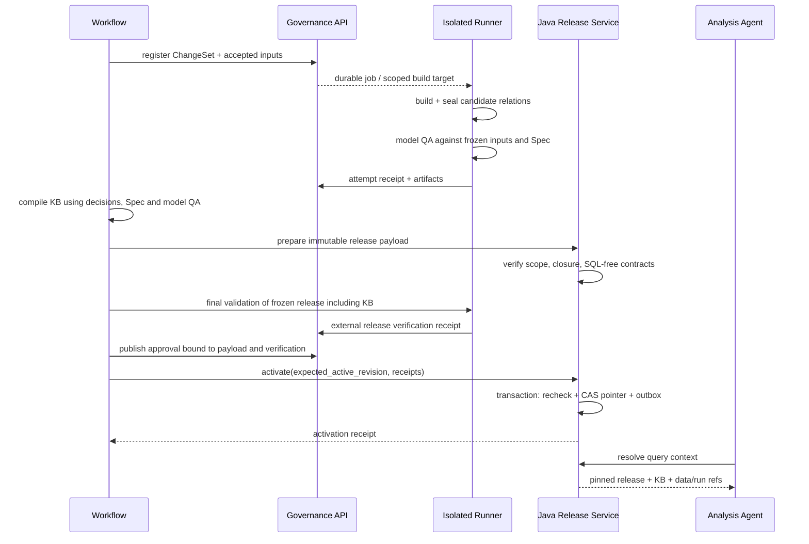

# 决策、Gate 与语义发布协议 v0.2

- 日期：2026-09-05；状态：协议草案，尚无对应实现。
- 上游：[架构细化 v0.2](./architecture-v0.2.md)。
- 下文 ID、选择、摘要占位值均为设计示例，不是客户确认或部署回执；JSON 示例仅说明字段，不是最终 JSON Schema。

## 1. 八条需要机器强制的不变式

1. 每个请求的 tenant/project/environment 来自已认证身份和项目登记，不能由普通 header 自行授予。
2. DecisionRevision、SemanticSpecRevision 和 release 的内容冻结后不覆盖；变化产生新 revision。
3. Gate 绑定具体内容摘要、适用范围、批准权限、时效及预期前置版本。
4. 未激活候选不能从正式 catalog/query/KB 路径访问；预览必须经过独立授权。
5. 单次查询与同一答案内的多次调用使用相同 release、BusinessRun、数据版本和 KB 包。
6. 激活前所有物理关系、权限范围、meta、KB 已准备完毕；激活不做远端构建。
7. 重复提交、旧 worker 回传、旧 gate、旧 active revision 都不能覆盖当前状态。
8. 回退只改变默认版本，不回退用户实时权限，不修改历史业务事实，也不让已失效数据重新合法可用。

以上单 release 示例面向语义工厂切片；正式 AI-native BI 适用 §9 的组合发布扩展，不能用旧激活路径绕过 Agent/问题评测检查。

## 2. 确认协议

### 2.1 页面输出只是答复

```json
{
  "schema_version": "0.2",
  "kind": "decision_response",
  "review_request_id": "review-demo-001",
  "project_id": "project-demo",
  "decision_id": "gap-default",
  "expected_decision_revision": 1,
  "preview_digest": "sha256:PREVIEW_DIGEST",
  "choice": "signed_gap",
  "comment": "用于表达超额覆盖与未覆盖；行动缺口仍保留。",
  "response_nonce": "RESPONSE_NONCE"
}
```

不接受客户端传入的 `approved_by`、`customer_confirmed`、租户授权或发布时间。页面需要展示问题、范围、候选定义、判别样例、数据日期、受影响资产与已知限制；预览包 digest 覆盖这些内容。

服务端登记的每个 choice 都绑定选定 Spec 的 `semantic_digest`：覆盖粒度、公式/聚合顺序、过滤、时间、单位、null/重复规则、匹配规则及业务参数约束。业务确认的 DecisionRevision 保存该映射，receipt 同时记录批准的 Spec；不能只记录一个含义宽泛的 decision_id。

`semantic_digest` 由版本化 schema 定义的业务投影计算，未知的影响语义字段必须拒绝。它不包含 provenance、实现路径、QA 回执及自身 digest，避免 Decision 与 Spec 相互引用形成摘要环。Spec 完整内容的 `digest` 另行覆盖其全部正文。修改业务投影必须重新取得业务批准；只改技术引用可复用业务批准，但仍需重做相应技术/发布检查。

对外静态页仍可离线使用。回传 JSON 后，已认证内部人员核实原答复渠道及确认人的授权，以“核验人对客户答复的见证”生成 receipt。保存原文件 hash、受限证据引用和两者不同的身份，不能称为客户数字签名。未来接入客户登录/签名链接时，替换身份核验方式，内容协议不变。

HTML 的内嵌 hash 不能证明页面未被篡改。受信入口从已登记 preview 还原核验材料；无法确定客户实际审阅的是该版本时，必须重新确认。客户端渲染应转义外部文本，回传 JSON 不得触发脚本或 shell。

### 2.2 接受与批准由 Governance API 生成

```json
{
  "schema_version": "0.2",
  "kind": "gate_receipt",
  "gate_id": "gate-demo-001",
  "gate_type": "business_definition",
  "scope": {"tenant_id": "tenant-demo", "project_id": "project-demo", "environment": "test"},
  "subject": {
    "type": "decision_revision",
    "id": "gap-default",
    "revision": 2,
    "digest": "sha256:DECISION_DIGEST"
  },
  "preview_digest": "sha256:PREVIEW_DIGEST",
  "approved_specs": [{"id": "spec-gap", "semantic_digest": "sha256:SPEC_SEMANTIC_DIGEST"}],
  "verification_method": "authenticated_attestation",
  "confirmer_ref": "party:business-owner-demo",
  "attested_by": "subject:internal-reviewer-demo",
  "authority_grant_ref": "authority:project-demo-gap-scope",
  "evidence_refs": ["restricted-evidence:response-demo-001"],
  "issued_at": "2026-09-05T08:00:00Z",
  "valid_until": "2026-09-12T08:00:00Z",
  "policy_version": "factory-policy-0.2"
}
```

`valid_until` 是本次批准用于提交/发布的期限，不是已确认口径自动失效日期；业务有效期另存于 DecisionRevision。批准过期后历史 receipt 仍有效留痕，只是不再用于新的 activation。

接受操作在事务中校验：身份/角色/范围、preview hash、问题当前 revision、nonce、证据权限、冲突定义及有效期。服务端生成不可变 DecisionRevision 与 receipt，并追加事件。相同 nonce + 相同 payload 返回原结果；相同 nonce + 不同内容返回 `409 IDEMPOTENCY_CONFLICT`。

同一个 metric/business_run/effective period 的不兼容默认定义不得同时接受；需要显式 supersedes 或区分业务场景。只有覆盖范围内的受影响资产被标记重审，不能把一次 gap 选择升级成整个项目已确认。

### 2.3 批准与撤销的并发规则

业务决策接受、gate 撤销和 release 激活都通过控制库的同一 project/environment 提交锁及 revision 检查串行化。激活时重新检查已接受决策版本、gate 状态、当前权限与候选 digest，不依赖先前的远程“校验通过”。

撤销发生在激活之前：阻止激活。撤销发生在激活之后：保留激活历史，创建 review_required 或 suspension 事件，按原因阻断后续查询/重新发布。紧急权限撤销的实时策略优先于所有历史 release。

## 3. Release Candidate 内容

```json
{
  "schema_version": "0.2",
  "release_id": "release-demo-r2",
  "scope": {"tenant_id": "tenant-demo", "project_id": "project-demo", "environment": "test"},
  "change_set": {"id": "change-gap-default", "revision": 3},
  "base_active": {"release_id": "release-demo-r1", "activation_revision": 7},
  "decision_refs": [{"id": "gap-default", "revision": 2, "digest": "sha256:DECISION_DIGEST"}],
  "spec_refs": [{"id": "spec-gap", "revision": 2, "digest": "sha256:SPEC_DIGEST", "semantic_digest": "sha256:SPEC_SEMANTIC_DIGEST"}],
  "business_run_ref": {"id": "run-2026-demo", "revision": 1, "digest": "sha256:PARAMETERS_DIGEST"},
  "data_binding": {
    "mode": "snapshot",
    "snapshots": ["snapshot-project-demo", "snapshot-order-demo", "snapshot-mapping-demo"],
    "bundle_digest": "sha256:DATA_DIGEST"
  },
  "build_ref": {
    "job_id": "job-demo-01",
    "attempt_id": "attempt-demo-01",
    "code_commit": "CODE_COMMIT",
    "toolchain_digest": "sha256:TOOLCHAIN_DIGEST",
    "manifest_digest": "sha256:DBT_MANIFEST_DIGEST",
    "model_set_digest": "sha256:FROZEN_RELATION_DIGEST"
  },
  "bindings": [{
    "logical_table": "won_validation_match_key",
    "datasource_id": 9001,
    "schema": "project_demo_build_01",
    "relation": "won_validation_match_key",
    "contract_digest": "sha256:TABLE_CONTRACT_DIGEST"
  }],
  "catalog_ref": {"uri": "artifact:catalog-r2", "digest": "sha256:CATALOG_DIGEST"},
  "resource_grants_ref": {"uri": "artifact:grants-r2", "digest": "sha256:GRANTS_DIGEST"},
  "kb_ref": {"id": "kb-project-demo-r2", "digest": "sha256:KB_DIGEST"},
  "model_qa_ref": {"uri": "artifact:model-qa-build-01", "digest": "sha256:MODEL_QA_DIGEST"},
  "verification_plan_ref": {"uri": "artifact:checks-r2", "digest": "sha256:CHECKS_DIGEST"},
  "publish_diff_ref": {"uri": "artifact:diff-r1-r2", "digest": "sha256:DIFF_DIGEST"},
  "policy_version": "factory-policy-0.2"
}
```

内容摘要由服务端针对规范化的冻结 payload 计算。所有文件引用需可解析并校验 hash，数值金额使用规定的 decimal 表示。示例的占位 digest 在真实提交中必须被真实 SHA-256 替换。

区分两阶段验收：`model_qa_ref` 是封存模型上的业务样例/对账结果，只绑定代码、模型、Spec、数据与参数摘要，不引用尚未生成的 release payload。它先产生，KB 可以纳入它，随后冻结包含 KB 的 payload。

最终 release validation 再验证该 payload 的完整性、meta/query/KB 一致性与授权。其 verification receipt、批准 receipt、activation 记录引用 payload digest，**不再放进 payload 自己的摘要输入**。发布审批 preview 同时绑定 payload digest 与最终 verification receipt digest；替换最终验证结果会使发布批准失效。最终验收状态从 registry 与运行时证据 envelope 提供，禁止回写同一份 KB 造成摘要循环。

源数据快照、参数、SQL、依赖、预期测试、catalog、授权范围、KB 内容或策略版本任一变化，都会得到新 candidate digest。Build attempt 与 release 可以多对一绑定，但每个 release 引用确定的已封存结果。

### 3.1 冻结的物理边界

模型名带版本并不足够：仍持有对象 ownership 的 build 账号可以继续修改它。封存必须由受信程序完成所有权/权限收敛、终止 build 会话、验证实际对象定义与依赖，生成 seal receipt；之后对封存对象做发布前 QA。

版本关系只能引用本版本关系、已登记且仍保留的不可变依赖、确定快照数据和版本化参数。禁止依赖 mutable `active` 参数、正在原地替换的 live view，或未登记的外部函数。首版全量构建本项目闭包，避免复杂的跨 release 共享。

Landing 的封存同样必须被强制执行：loader 只能写当前开放批次，不能向已封存 snapshot 追加行或修改/清空它。首版可采用独立批次表/分区及所有权转移，后续再优化；仅给记录增加 snapshot_id、同时继续允许 loader 全表 TRUNCATE，不满足不可变输入约束。

数据持续刷新时产生新的 snapshot/data revision 和验证记录。可按预先批准的刷新策略自动激活“相同 spec + 新数据”的 release；策略需限定 schema 不变、质量阈值、允许时延、停止条件。它不是通用豁免新口径的权限。

## 4. Prepare / Validate / Activate



### 4.1 Prepare

同一 release_id 与相同摘要幂等；同 ID 不同内容拒绝。校验项目身份、全部工件可读、不可变关系存在且已封存，登记 candidate 与其 catalog/grants/KB 引用。预加载 KB 内容并验证摘要，查询侧不可发现 candidate。

物理读取身份可由服务器以 release-scoped connection/role 绑定；不得把跨项目的共享高权限连接交给 runtime 工具。即使技术层已准备读权限，正式 API 仍需 release 可用性和当前主体权限双重检查。

### 4.2 Validate

必须证明预期测试全部执行且符合策略，不能只看进程退出 0。校验范围包括：

- 关键模型和必需测试是否被实际执行，SKIP/未选中不能当通过；WARN 是否有有效例外。
- 对账是否绑定相同数据、参数和基线版本；未知差异不是 PASS。
- 粒度、join 基数、空值、单位、时间、聚合顺序和兼容指标是否符合 Spec。
- catalog 所有引用是否闭合；SQL-free 元数据是否仅使用支持的结构；缺表/未知列/自由 `sql_expression` 拒绝。
- 每个物理关系是否 fully qualified、被本 release 允许，并且依赖没有穿入 live 可变对象。
- KB 是否可通过目标读取接口按版本检索；回答 schema、口径状态与日期是否完整。

dbt build 的默认产物含 manifest 和 run results，不应假定所有版本都自动生成 catalog；实现时固定 dbt-core/dbt-postgres 与 artifact schema 版本，并按该版本显式生成或收集所需 catalog。[dbt build 官方文档](https://docs.getdbt.com/reference/commands/build)

### 4.3 Activate

服务端在控制库事务中：

1. 锁定 project/environment 提交状态与 active pointer，检查预期 activation_revision。
2. 核对 candidate、verification receipt、seal receipt、preview 与 gate 的摘要及批准范围；每个 Spec 的 semantic_digest 必须匹配该业务 gate 批准的选择，不能仅因 decision 引用存在就放行。
3. 检查相关 decision revision 仍被接受、gate 未过期/撤销、资源未被暂停、数据仍可用。
4. 检查实时授权与例外策略；不为调用者自动添加权限。
5. 更新 active pointer 的 release_id 和单调递增 activation_revision；写 activation event 与 outbox。
6. 提交，返回 receipt。消息失联时按请求幂等键查询同一个结果。

锁只覆盖控制库提交，不在持锁期间执行 dbt、远程 QA 或 LLM。已准备资源在冻结后若被外部破坏，runtime 返回不可用错误；不能把原子 pointer 描述成跨数据库存储的分布式事务。

若审批后另一个 release 已生效，返回 `409 ACTIVE_RELEASE_CHANGED`。重新计算 diff、重验受影响部分并取得新发布批准；不能让“last writer wins”覆盖并行工作。

## 5. 回退与查询一致性

回退请求也是 CAS activation：目标为历史 release，期望为当前 activation_revision。检查历史数据仍保留、关系未变、KB 可读、当前权限和 suspension 策略允许；使用独立 rollback receipt 或预先批准的自动回退策略。

前向发布与回退使用不同的 activation envelope，不能把回退简单等同于重发历史的激活请求：

```json
{
  "operation": "rollback",
  "target_release_id": "release-demo-r1",
  "target_payload_digest": "sha256:R1_PAYLOAD_DIGEST",
  "expected_active": {"release_id": "release-demo-r2", "activation_revision": 8},
  "rollback_preview_digest": "sha256:R2_TO_R1_DIFF_DIGEST",
  "authorization_ref": "rollback-gate-demo-001",
  "idempotency_key": "rollback-request-demo-001"
}
```

新 rollback receipt 绑定当前到目标的 diff、目标不可变摘要、当前 expected_active 和当前策略。它替代原发布 gate 的过期检查及原 payload `base_active` 的前向基线比较，不替代业务定义有效性、撤销、suspension、数据可用性或实时权限检查。目标 payload 的历史 base_active 保留为来源信息，绝不修改它来通过 CAS。历史业务 gate 的使用期限已过不抹去当时的接受事实，但新决策若已禁止旧口径，就不能回退到它；需先重新授权业务定义并生成新的 release。

回退使用重新验证的 readiness receipt（或当前策略允许复用的验证证据），而不是默认相信数月前的可用性。自动回退策略需预先限定适用 scope、目标、触发条件、有效期及权限，不能成为任意版本切换的通行证。

回退后正在执行的请求仍读取其已固定版本，除非涉及必须立即停止的权限撤销。新请求读取回退目标。资源清理需检查 active/在途查询/预览/可回退版本的引用；请求上下文设有限 TTL，禁止无限固定导致无法清理。

查询上下文至少返回：

```json
{
  "query_context_id": "query-context-demo",
  "release_id": "release-demo-r2",
  "activation_revision": 8,
  "business_run_ref": "run-2026-demo@1",
  "data_bundle_digest": "sha256:DATA_DIGEST",
  "kb_digest": "sha256:KB_DIGEST",
  "expires_at": "2026-09-05T09:05:00Z"
}
```

该上下文须由服务端保存或签发，不信任客户端自己拼出的值。meta discovery、metric query、KB retrieval 共用它。KB 不可用时，可返回有结构化定义/限制的指标数据，但不能编造完整业务解释或回退到另一版 KB。

查询结果包含 value、unit、filters、groupBy、metric/spec revision、源数据 as-of（多源分别给出）、queried_at、definition_status、validation_status、limitations、decision/QA 引用。若回答无法确定默认 gap 口径，应请求澄清或并列两个口径；不能静默替客户选择。

首版 snapshot 模式允许跨多个工具调用保持数值一致。未来 live 模式必须另外定义水位与读取隔离，不能只 pin release_id 就宣称跨调用数据一致。

## 6. API 与存储最小面

以下是待实现的增量协议，不代表现有接口已支持。

| API | 关键语义 |
|---|---|
| `POST /api/v1/factory/projects/{id}/changes` | 输入 expected_project_revision、变更范围，登记变更集 |
| `POST .../decision-responses` | 校验静态答复；未核验身份前保持 response_received |
| `POST .../gates` | 认证审阅者提交批准/见证；服务端核验并出 receipt |
| `POST .../gates/{gateId}/revocations` | 同 scope 提交锁内追加撤销与影响记录 |
| `POST .../jobs`、`GET .../jobs/{jobId}` | 幂等任务登记与结果查询；runner 另有受限回传接口 |
| `POST .../releases` | prepare 冻结 payload；不改变正式 catalog |
| `POST .../releases/{releaseId}/validations` | 提交可核验的验证回执，注册 readiness |
| `POST .../releases/{releaseId}/activations` | CAS 激活或回退；事务核验全部前置条件 |
| `POST .../query-contexts` | 根据认证作用域解析并固定可访问版本 |
| 既有 meta/query 接口的严格模式 | 使用 query_context；拒绝缺 scope、混版、未知 meta 与自由 SQL |

表可按领域逐步新增：project/change、decision_revision、gate_receipt/revocation、job/attempt、release/artifact_refs、active_release、activation_event、outbox。不可变 JSONB body 配合版本与唯一键即可，首版无需通用事件溯源平台。

唯一约束至少覆盖 `(tenant, project, entity_id, revision)`、`(scope, idempotency_key)`、`(scope, release_id)`，以及每个 scope 唯一 active pointer。事件追加与当前投影在同一事务更新，避免双写。

Java 的必要改造：

- AuthContext 绑定租户/项目/环境/主体；管理、预览、消费、授权分权。
- 版本化 meta 读取与 dependency resolution；一次查询不混读全局 overlay 和最新数据库对象。
- 严格模式空 grants 拒绝；完整 schema 引用；不启用 classpath/弱租户/自由 SQL 回退。
- receipt 与 release 原子提交；当前权限撤销独立于 release；错误码可操作。
- 限制旧 meta/grant/raw-query 管理入口对工厂 scope 的访问；否则新 gate 可以被旧 API 绕过。

现有非工厂项目可通过显式 legacy 模式逐步迁移，不能在 strict 模式失败时自动退回 legacy。

## 7. 失败行为

| 失败点 | 外部结果 | 恢复策略 |
|---|---|---|
| job 提交后、队列投递前进程退出 | job 已登记；未丢失 | outbox 继续投递 |
| build 部分完成或 worker 崩溃 | 正式 R1 不变；候选不可见 | 新 attempt/schema；清理旧进程后再回收 |
| build 成功但测试漏跑 | validation 失败 | 补齐检查，不生成 publish-ready |
| KB 入库/载入失败 | prepare/validate 不通过 | 幂等重试相同摘要内容 |
| 批准后内容变更 | `GATE_SUBJECT_CHANGED` | 新 revision 和受影响 gate |
| 并行发布改变 active | `ACTIVE_RELEASE_CHANGED` | 重算基线与 diff，再批准 |
| activation 提交后回包丢失 | 状态可能已成功 | 查询原幂等请求，不重复造 release |
| 激活后 smoke 失败 | 新查询暂停或按策略回退 | 保留失败版本与证据，不覆盖为 PASS |
| 无授权、KB 查询跨项目 | `FORBIDDEN` | 不做降级检索或 datasource 回退 |
| 历史数据已删除 | `RELEASE_DATA_UNAVAILABLE` | 禁止回退；仅保留可查的定义/审计 |

## 8. 对“不引入过多工程”的约束

P1 离线试点可用单进程事务存储 adapter 验证决策与摘要协议；多人并发、发布和 runtime 接入必须使用上述正式权威路径。不能把离线 demo 的文件锁当作服务端多进程协议。

先实现项目特定的三种 gate、一个 query context 和一个发布路径。暂不实现通用审批设计器、通用 DAG 引擎、图数据库、全量列级 lineage 或多平台 exporter。接口实现与首个验收用例一起推进，避免先造空平台。

## 9. AI-native BI 组合发布扩展

详细对象与理由见[分析库与 Copilot 设计 §6](./verified-analysis-and-copilot-design.md#6-发布单位扩展数据语义与-agent-行为分别版本化)。本节仍为待实施契约：

1. 增加不可变 `AgentRelease`，覆盖模型/参数、prompt、编排/工具实现与策略、skills、Recipe 快照、检索和回答/图表规则。凭据仅存引用，当前用户授权不冻结为历史权限。
2. 将本 scope 的 active pointer 扩展为 `DeploymentBinding = (semantic_release_id, agent_release_id, activation_revision)`；沿用 Java 控制库、scope 提交锁、outbox、幂等和 CAS，不并行维护两个权威指针。
3. activation/rollback envelope 的 target、expected_active、预览、批准与回执绑定完整 tuple 和两类 payload 摘要；预览、批准和 envelope 同时绑定具体 `evaluation_receipt_digest`。同一 tuple 替换评测证据也须重新批准。原 release activation 入口须转入同一组合检查，缺 agent 版本拒绝，不默认选 latest。
4. 冻结两类 payload 后执行问题评测；外部 EvaluationReceipt 绑定二者摘要、数据/BusinessRun、Suite/评分策略及 evaluator 版本。回执不写回被冻结 payload/KB，保持无环。验收策略变更需要有权评审者批准，候选 Agent 不能自行删题或降低要求。
5. 事务内重检语义 readiness、适用业务批准、Agent/Recipe 兼容性、问答验证、当前权限/撤销和发布批准；实际 EvaluationReceipt 的摘要必须等于预览、批准和 envelope 所绑定的摘要。仅改 Agent 可复用未变语义资产的有效批准，但新组合必须有适用评测与新发布批准；不要求重建未变 dbt 模型。
6. QueryContext 增加 `agent_release_id` 及对应摘要；AnalysisRun 固定同一组合，记录实际使用的 Recipe revision。正式知识/方案检索与查询共用 context；对话继续分析不能静默切版本。模型服务不可用时明确报错，不偷偷切未评测模型。
7. 缓存按 scope、两类 release、数据/参数、检索配置和权限上下文隔离；命中缓存仍重检当前权限及 suspension，包含 Recipe 撤销。不得借历史方案或缓存结果恢复已撤销访问。
8. 回退使用新的完整 tuple envelope，重检目标模型/工具/Recipe 是否仍获准、语义兼容、数据可用及策略要求的验证证据。历史 prompt/工具存在已禁用风险时拒绝，不因语义 release 可用就整体放行。

为了保持首版可控，AgentRelease 可由治理服务注册一个固定配置版本，再逐步开放替换；“固定”也必须有明确 digest 和评测绑定，不是运行时进程的隐含配置。
