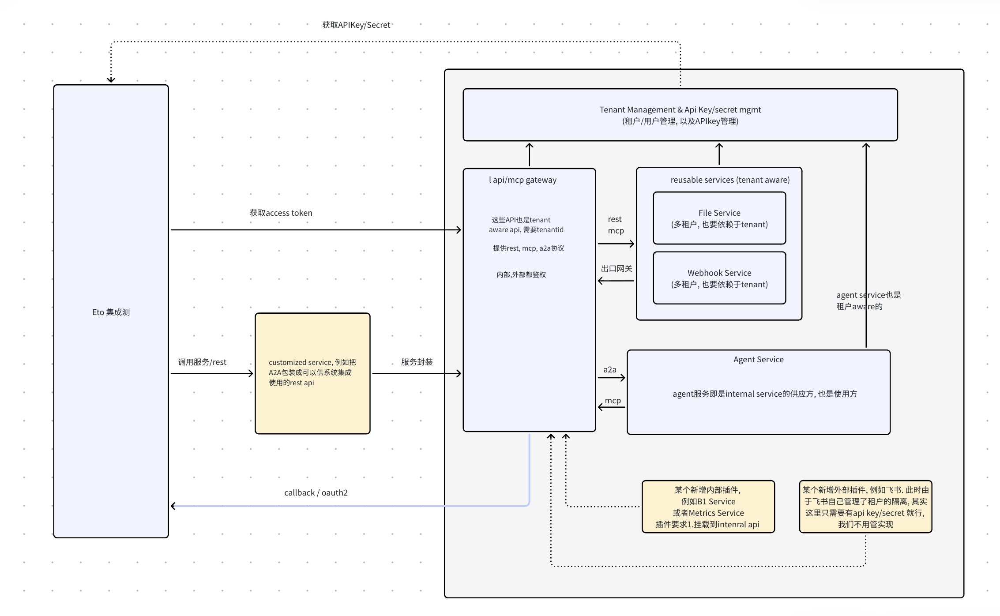

# Agentic Semantic Factory — 评审简报

- 日期：2026-09-05
- 目的：供独立评审（AI 或人类）在不了解原始讨论上下文的情况下分析本方案
- 评审者可自由探索本仓库取证；关键证据路径见 §12

## 0. 给评审者的说明

你在评审的是一套从客户项目实践复盘中归纳出的**"AI 驱动语义资产工厂"方法论与目标架构**。它已在真实客户项目（Hankel Run for Gold）上人工走通过一遍完整流程，本方案的命题是：把它 agent 化，使第二个及以后的项目的启动、建模、口径确认、验证主要由 AI 执行、人在确认门把关。

请重点分析：① 架构健全性与遗漏；② 已定决策的反面论证；③ 最小路径是否最优；④ 效率与竞争判断是否可靠。§10 列了 10 个具体问题；§11 是工厂所依托的平台运行时基座架构图，评审时应把两者放在一起看。

## 1. 背景与实践基础

团队维护一个多服务 demo/交付栈（Node agent 网关、Python FastAPI、Java metrics-server 语义查询服务、SAP B1 代理、CDP 服务、文档解析服务）。最近在客户项目 Hankel（消费品 ACM/GTM 场景）上人工完成了一次完整的语义资产建设：

- 数据质量诊断 → Excel 原始数据导入 → datasource 探查 → PostgreSQL 语义视图（14+ view）→ 24 个 SQL-free 指标发布 → 客户口径知识化（6 篇知识库文档 + 7 态状态机）→ golden report 对账 → 线上验证
- 耗时约 2 人日；每一步有结构化工件（导入回执、发布脚本、KB、对账 SQL）
- 已暴露的痛点：项目启动零留痕（tenant setup 无任何工件）；口径确认靠人工整理客户答复；口径变更需手工联动 5 处（view → publish → 发布 → 复测 → KB）；20 个书面规范指标因人工吞吐不足至今未发布

## 2. 方法论：四循环 + 一常开面

```
循环0 项目启动: 访谈 → 项目章程 → tenant/datasource/grants/KB骨架（gate: 章程确认）
循环A 知识获取: 质量诊断 → 决策积压 → 确认HTML app → decisions/*.json → KB编译+状态流转（gate: 口径确认）
循环B 语义加工: 受grants约束的探查 → 建模提案 → dbt models+tests → build（gate: CI全绿）→ metric meta发布（gate: 发布预览）
循环C 验证回归: golden report/基线对账 → 差异披露或回炉 → 验收记录
常开面 运行时: Analysis Agent 只依赖 meta API + metric query + KB路由，回答带证据结构
```

Hankel 已人工走通过循环 A 的一次完整实例（Sell-in 白名单：诊断发现差异 → 客户确认规则 → view 实现 → 复测 PASS），agent 化即把每一棒自动化。

## 3. 第一性原则（11 条）

1. **P1 工件化**：每环节产出结构化工件，可版本可追溯，不是聊天记录
2. **P2 确认门**：不可逆/高成本/对外的事必须 human gate，决策落地为 `decisions/*.json`
3. **P3 状态机**：资产有 `business_status`（7 态），项目有生命周期（8 态）
4. **P4 权限分层**：builder 走 grants+受治理探查；运行时只见 meta+metric query；raw 表不暴露
5. **P5 对账自证**：每步配验收；对账保持 diagnostic，差异披露不抹零
6. **P6 知识分层**：方法论模板（跨项目）与项目实例分开，实例可回流模板
7. **P7 落地统一**：一切源先落 governed landing schema，下游与源解耦
8. **P8 运行时无 SQL**：复杂逻辑在 view/model，metric meta 只有聚合与比率
9. **P9 溯源留痕**：落地行带 source_file/sheet/row；回答必带 asOf/口径状态/质量说明
10. **P10 隐私边界**：人名、终端客户明细不进持久化 KB/报告/日志
11. **P11 Landing 后只 SQL**：数据落地后，一切"数据→数据"变换只有 SQL（dbt）一条通道；staging/marts 的生产者只有 dbt；非 SQL 逻辑（ML、模糊匹配、沙箱计算）只能以"新落地源"身份重新进入，不得插入变换链

## 4. 架构分层

L0 连接与落地（Excel/DB/文件/报表 → landing，留痕）→ L1 诊断与决策（Profiler + 确认 app + decisions）→ L2 知识层（KB 编译器、business_status、ontology）→ L3 语义加工（dbt: staging/intermediate/marts + tests）→ L4 发布（SQL-free metric meta + EXACT grants）→ L5 运行时（meta + metric query + KB）。横切：PM Agent（项目状态机 + manifest + gate 调度）。

## 5. 双状态机

- **项目生命周期**：onboarded → data_landed → diagnosed → scope_confirmed → modeled → published → verified → live →（新一轮循环）。每个迁移对应一个 gate（确认 app / CI / 人复核）。
- **资产 business_status**（沿用 Hankel 7 态）：customer_confirmed / customer_confirmed_semantic_foundation / written_spec_reference / pending_business_confirmation / demo_quality / technical_diagnostic / demo_fixed_parameters。规则：状态只经确认门流转；runtime 回答必须携带状态；runtime 与客户口径不一致时报告差异，禁止改知识库迁就 SQL。

## 6. Agent 编制

| Agent | 产出 | Gate |
|---|---|---|
| Bootstrap/PM | 项目章程、manifest、租户/骨架 | 章程确认（人） |
| Profiler | 质量报告、决策积压 | — |
| 确认 app（装置） | decisions/*.json | 人 |
| Curator | KB 草稿、状态流转 | 知识审阅（人） |
| Explorer | 建模范围提案 | 提案确认 |
| Modeler | dbt models + tests（强制成对） | CI 全绿（自动） |
| Publisher | metric meta + grants | 发布预览（人） |
| Reconciler | 对账报告 | PASS 或差异披露 |
| Analysis | 证据化回答 | — |

## 7. 已做出的关键设计决策（评审重点）

| # | 决策 | 理由（已论证） |
|---|---|---|
| D1 | 转换层直接用 dbt-core（dbt-postgres），不自研 | 护城河在知识循环不在 SQL runner；dbt 模式对 LLM agent 最友好；白送血缘/测试/原子替换 |
| D2 | 确认 app = 静态 HTML + decisions JSON 回传；对内走网关 POST；不做带登录的 Web 应用 | 客户零安装是硬约束；价值在积压证据质量不在工程外壳 |
| D3 | 追溯三级：L1 决策→资产集合、L2 资产→决策（自动注入 based_on_decisions）第一天强制；L3 列级自动血缘只做 CI 警告 | L1/L2 即可支撑影响分析；L3 强制会产生无人维护的假血缘 |
| D4 | 参数两分法：业务参数（赛期/阈值）进配置表（参数是数据，寿命跟 run 走）；工程参数用 dbt vars；新建 run 本身是一条决策 | dbt vars 改参数需重新部署且无法多 run 共存 |
| D5 | KB 隔离：collection=tenant 强绑定 + manifest linter + 禁止跨租户引用；不复制 metrics v1 的弱租户回退 | 现有 metrics runtime 的 tenantId 是弱上下文（无 grants 时回退同 datasource），KB 必须更严 |
| D6 | 模板回流：≥2 项目确认或 1 项目+书面规范 + 项目无关化 + 隐私清洗，KB owner 一票审批 + git PR；初期宁滥勿缺 | 复利瓶颈是没人沉淀，不是不够精 |
| D7 | 安全：PG 角色×schema 矩阵（dbt 对 landing 只读、只在 stg/mart 有 CREATE、控制面零权限）；禁复用 metrics-server 的 SPRING_DATASOURCE 凭据（现有导入脚本从容器 env 挖密码，密码已进 shell history，需轮换）；dbt 蓝绿改用 in-place replace（schema 切换会使已发布 meta/grants 失效）；沙箱约束（无网络出口/只读或零凭据/资源上限/代码即工件） | dbt model 是 CREATE..AS SELECT，天然无任意 DML；agent 被劫持的爆燃半径=自己 schema 的错误数据，恰是 tests/对账的职责范围——安全边界与质量门重合 |
| D8 | 动态部署：dispatcher（CLI→factory-runner 小服务：FastAPI+Celery，复用 document_service 的 Redis/Celery 运维经验）；不上 Airflow（避免第二个编排大脑，gate 在状态机不在 DAG）；不进 Java（builder/runtime 分离）；agent 部署权=提 PR；两段式上线：dbt build ≠ runtime 可见（Publisher diff + 发布 gate 是最后一道门） | dbt build 是单命令自编排；PM agent 长在已有 @axiom-lattice 工作流引擎上 |
| D9 | 清洗分工：EL 是代码（薄且忠实，只写 landing）；T 全 SQL（dbt staging）；清洗规则检验法"能否写成一列 SELECT 或一个 schema.yml 测试" | 清洗入 SQL 是治理要求：决策对齐、血缘可走通、可测试、幂等、agent 可生成 |
| D10 | 业务自助四层边界：T1 组合消费=业务+AI 零 IT；T2 现有 view 上新指标=轻 gate；T3 新视图=业务分析师+AI 起草+人审；T4 新源/权限/架构=IT。瓶颈从"IT 排期"转移到"确认 gate" | SQL-free metric meta 使 T2 不写 SQL 即上线是设计出来的性质；治理被预先支付是与经典自助 BI 的本质区别 |
| D11 | 竞争定位：平台（Genie/Cortex/Spotter）会商品化 T1–T3 的生成与问答；工厂站语义层**上游**——产出 AI-ready 语义资产喂给任何平台（要求 metric meta 可导出平台格式）；护城河是复利资产（decisions 语料/行业模板/对账基线）；近期竞对是数据目录公司 AI 化与 SI 服务产品化 | 平台服务拥有数据的企业内部，确认人在其边界之外；平台卖消费，冷启动是交付性工作 |

效率预期（待 M5 基准验证）：单项目构建 2–4x（Hankel 基线 2 人日）；口径迭代 5–10x（现每次变更手工联动 5 处）；不改善项：客户确认墙钟时间、人审时间、口径探索、新系统运维学习成本。

## 8. 最小路径

| 步骤 | 内容 | 验收 |
|---|---|---|
| M1 | 项目 manifest schema + bootstrap 工具（6 个幂等动词：init/register/import/grants/kb/status）；import 提升现有 tmp 脚本（Excel→SQL→回执）并自动生成 staging 模型骨架 | onboard 一个空测试项目幂等成功 |
| M2 | 决策确认 app + decisions schema + KB 编译器；第一批积压=KB 中 11 条待确认项 | app 勾选→JSON→KB 重生成、状态流转 |
| M3 | dbt 迁移 run-for-gold-views.sql（14 view 成 model+test 成对，golden report 做 fixture 验收，参数 run-scoped 化）；接 CI PR 构建 | build 全绿；publish 消费 dbt artifacts |
| M4 | Excel→landing 正式通道 | 多 sheet 落地带溯源，Profiler 出报告 |
| M5 | 压力测试：Dashboard 20 个书面规范指标全流水线；含"业务操作者测试"（非 IT 用户新增 1 指标+1 视图） | 工厂指标：非 gate 人工介入=0、工件自动生成率≥90%、总耗时对照基线 |

## 9. 自我识别的风险

1. 口径通胀/状态机被绕过（最大治理风险）
2. gate 摩擦失衡（太高退回 IT 队列，太低指标混乱）
3. 弱测试放行 AI 错翻译
4. 冷启动仍是 IT 重活，"自助"只对已 onboard 项目成立
5. 共享 PG 实例上控制面与数据面同库（已列 REVOKE 级隔离为动手前置，长期建议分实例）
6. 现有 metrics runtime 的弱租户回退与 KB 严格隔离之间的不一致
7. 团队需学习 dbt/CI/角色矩阵，第一个项目可能不快反慢

## 10. 请评审者重点分析的 10 个问题

1. 四循环+状态机模型是否有遗漏的循环、状态或 gate？项目生命周期 8 态是否够？
2. P11 不变式（landing 后只 SQL）有哪些未覆盖的现实例外？沙箱"报告通道/落地通道"二分是否完备？
3. business_status 7 态是否够用？decisions 与资产的 L1/L2 追溯是否足以支撑"决策变更→受影响资产重审"的影响分析？
4. 安全模型：共享 PG 实例上控制面/数据面同库的风险是否被低估？角色矩阵是否有漏洞（如 dbt service account 的密钥轮换、CI 与 prod 凭据分离）？
5. in-place replace 的取舍：视图短暂不一致窗口在什么场景不可接受？"双对象+指针 view"是否应是默认而非后备？
6. M1–M4 的范围与顺序是否最优？是否有更小的首个切片（例如跳过 dbt 先证明循环 A）？
7. 业务自助 T2/T3 边界是否现实？业务操作者测试的设计是否充分？业务用户绕过 Curator 直接发布的风险如何防？
8. 竞争判断（"平台做不了跨组织确认闭环"）是否站得住？若 Snowflake/Databricks 推出 partner-delivered semantic services，定位是否失效？
9. 效率估计（构建 2–4x、迭代 5–10x）偏乐观还是保守？哪些环节的成本被忽略？
10. 对现有 metrics-server 的改造要求（meta/tables、meta/metrics、grants、弱租户回退修复）是否被低估？Java 侧是否需要新增能力？

## 11. 平台运行时基座（2026-09-13 补充）



工厂不另建网关与租户体系，寄生于上图的平台运行时基座。图的核心思想：**统一入口、一切 tenant-aware、Agent 既是服务的提供方也是消费方**。

图的要素：

1. **api/mcp gateway 是唯一入口**：复用 REST / MCP / A2A 三种协议；内外部统一鉴权；所有 API 要求 tenantId。
2. **Tenant Management & API Key/Secret 管理位于顶层**：外部（Eto 集成侧）获取 APIKey/Secret → 换取 access token → 调用；callback/oauth2 支持回调流。
3. **可复用服务**：File Service、Webhook Service，本身即多租户（tenant aware）。
4. **Agent Service**：既是 internal service 的供应方也是使用方；本身也是租户 aware 的。
5. **插件机制分两类**：内部插件（图中举例 **B1 Service 或 Metrics Service**）要求挂载到 internal api；外部插件（如飞书）因对方自管租户隔离，只需提供 api key/secret，不管理其实现。
6. **egress gateway**：内部服务的统一出口；**customized service**：把 A2A 包装成 REST 供传统系统集成。

与工厂的对位关系：

| 平台组件 | 工厂落位 |
|---|---|
| Metrics Service（内部插件） | metrics-server 挂载为平台插件；L4 发布（meta/metrics、grants）在此落地 |
| **File Service** | ✅ 已落地为 `platform-service/` files 模块（Spring Boot 3.2，5707，nginx `/api/filesvc/`）：path 寻址、不可变版本化、无 folder 表、透明多租户（TenantLine 拦截器）；设计对齐 fina-ai file 服务，见 [file-and-webhook-services](./file-and-webhook-services.md) |
| **Webhook Service** | ✅ 已落地为 `platform-service/` webhooks 模块：自托管 **Svix**（选型评估与 Outpost 对比见同文档 §4）经租户模型 facade（`/api/webhooks/`→`/api/v1/webhooks/*`）：Standard Webhooks 签名、whsec 自动生成、attempts 查询；**本机全链路冒烟通过**（发布→投递→验签，2026-09-13） |
| Agent Service | PM agent 与各流水线 agent（Curator/Modeler/Publisher/Analysis）的运行位置，经 a2a/mcp 互调（D8 中"PM agent 长在已有工作流引擎上"的基座即此） |
| File Service→landing 衔接 | M4 的 `import` 动词从 File Service 按 path 取原件再解析（loader 职责不变） |
| Webhook Service + 外部插件（飞书） | 确认 gate 的通知与回调通道；Portal 链接 + whsec 签名密钥已具备，飞书"只给 key 不管实现"对接待接 |
| Tenant Management / tenant-aware gateway | KB collection=tenant 强绑定（D5）、datasource grants、项目 manifest 隔离的平台级基础 |
| customized service（A2A→REST） | Eto 等外部系统集成工厂能力的兼容通道 |

对评审的启示：简报 §10 问题 10（对现有服务的改造要求）应扩展为"metrics-server 作为内部插件挂载该基座需要什么"；问题 4（安全）中凭据与租户隔离应按平台基座的 API key/secret 模型复核。

## 12. 文件索引与仓库证据

**方案文档**（本目录）：
- `README.md` 方法论与架构总纲 ｜ `m1-bootstrap-design.md` M1 具体设计
- `open-questions-recommendations.md` 开放问题决策 ｜ `security-notes.md` 安全设计
- `dbt-dynamic-deploy.md` 动态部署与宿主选型 ｜ `etl-vs-sql-cleaning.md` 清洗分工与沙箱
- `self-service-boundary.md` 业务自助边界 ｜ `competitive-landscape.md` 竞品对照
- `assets/platform-runtime-architecture.png` 平台运行时基座架构图（§11）

**仓库证据**：
- `metrics-server/docs/hankel-run-for-gold-semantic-assets.md` — 14 视图/13 指标/发布流程/对账设计
- `metrics-server/docs/hankel-metrics-kb/`（6 篇 + manifest.json）— 口径知识化、7 态状态机、质量规则、待确认项
- `metrics-server/scripts/hankel/` — run-for-gold-views.sql（40KB 手写视图）、publish 脚本、verify SQL
- `metrics-server/docs/api-inventory.md`、`agent-tools-datasource-metrics-guide.md` — 可包装的 API 面
- `tmp/hankel_new_raw_import/manifest.json`、`run_remote_import.sh` — 导入回执雏形与凭据风险实据
- `tmp/hankel_tenant_setup/`（空目录）— 启动零留痕的证据
- `tmp/hankel_dist_review_import/formula_dependencies.csv` — 清洗逻辑藏在客户 Excel 的实据
- `agent/package.json`（@axiom-lattice/*）— PM agent 可依托的工作流引擎
- `document_service/`（Celery+Redis）— factory-runner 的运维先例
