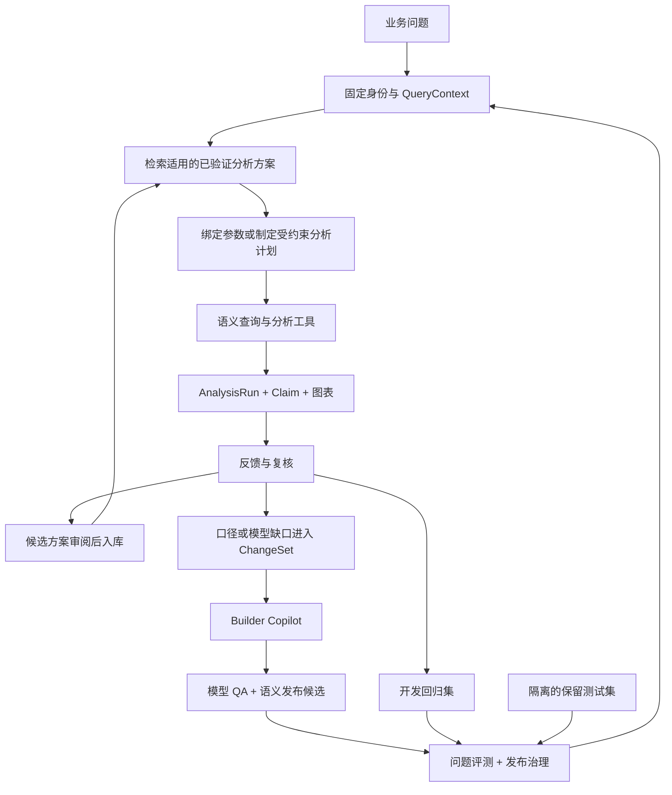

# AI-native BI：已验证分析库、问题评测与建模 Copilot

- 日期：2026-09-05；状态：架构增补，尚未实施或运行评测。
- 上游：[架构 v0.2](./architecture-v0.2.md)、[发布协议](./contracts-and-release-protocol.md)、[试点计划](./pilot-and-validation-plan.md)。
- 阅读约定：§1 为官方机制摘要；§2 起是针对本项目的设计建议，不代表厂商现成功能或我们的已实现能力。

## 1. 三种机制解决三个不同问题

| 参考能力 | 核心问题 | 在本架构中的落点 |
|---|---|---|
| Snowflake Verified Query Repository（VQR） | 这种业务问题，过去怎样正确查询？ | VerifiedAnalysisRegistry：已验证分析库 |
| Databricks Genie benchmarks | 修改上下文/模型之后，真实问题还答得对吗？ | Question Evaluation：问题级回归与独立评测 |
| dbt Copilot / Wizard | 怎样借助项目上下文生成、验证和维护数据资产？ | Builder Copilot：Modeler 的开发工作流 |

三者是互补关系：**提供参考解法、检验实际行为、改进底层资产**。示例丰富不等于答案正确；模型测试通过也不等于业务问题回答正确。

### 1.1 Snowflake：把正确问法与查询作为受维护知识

VQR 在语义模型中保存问题、SQL 及验证信息，供相似问题生成查询时参考；SQL 使用语义模型的逻辑对象。作者需要核对查询与结果，错误示例也会误导系统。它不是结果缓存，也不是“存入后由平台自动证明正确”。[官方 VQR 文档](https://docs.snowflake.com/en/user-guide/views-semantic/verified-query-repository)

值得吸收的是：把专家验证过的解题方式变成一等资产，保留验证来源和适用条件。不能把一次命中示例直接转成“本次回答置信度 100%”。

### 1.2 Databricks：从 SQL 测试升级为问题测试

Genie benchmarks 保存业务问题及参考答案，用来反复评价行为。Chat 模式比较查询结果；Agent 模式支持多步骤分析和基于评估说明的 LLM judge。官方建议覆盖同义问法；每个 benchmark 开启新会话，不能据此证明多轮对话正确。监控中的反馈需要被用于维护指令或基准，反馈本身并不自动改变行为。[官方评测文档](https://docs.databricks.com/aws/en/genie-agents/monitor)

值得吸收的是：业务问题本身成为版本化测试资产，检查最终行为而非 SQL 字符串。我们另行定义金额精度、合法空结果、多轮和权限断言，不直接照搬厂商判分规则。

### 1.3 dbt：区分 Copilot 和完整开发 Agent

当前官方文档仍区分两者：Copilot 提供 SQL、文档、测试、语义模型等快速生成辅助；完整的项目调查、开发、验证工作流则推荐 Wizard。不能简单理解为 Copilot 改名，也不能将托管产品等同于 dbt Core 的内置能力。[Copilot 概览](https://docs.getdbt.com/docs/dbt-ai/copilot-overview)

Wizard 的机制重点是提前建立项目元数据索引，利用依赖、测试、运行结果和语义定义理解变更，并按风险规划验证；未执行或不适用的检查需要可见。我们吸收“先理解项目、再改动、最后验证”的流程，但不把普通 dbt manifest 当成完整列级 lineage。[Wizard 工作机制](https://docs.getdbt.com/docs/dbt-ai/wizard-how-it-works)

直接集成也有候选路径：Wizard 提供 headless 执行和结构化输出，目前文档标记为 Beta。可后续作为受限 runner 候选评估，不能把其无交互执行模式当作我们业务批准或发布 gate。[Headless 文档](https://docs.getdbt.com/docs/dbt-ai/wizard-headless)

## 2. 总体闭环：回答问题与生产资产分开

普通问题在已发布语义能力内分析，不必每次新建 view、走业务审批。沙箱中的临时计算登记为 AnalysisRun 派生结果，不能冒充已批准指标；反复使用且需要正式复用时，才提为 ChangeSet，沿现有业务确认与模型发布协议晋升。

该增补不要求新建三个服务。首版用现有 Governance 控制库存版本/回执，工件存储保存方案与评测，现有 Agent 执行分析，CLI runner 跑模型和问题测试。

## 3. VerifiedAnalysisRegistry：存分析方案，不存任意物理 SQL

### 3.1 方案契约

将 VQR 思路扩展成 `VerifiedAnalysisRecipe`。简单问题是一条语义查询；复杂问题是有前置条件、分支和终止条件的工具计划，不只是示例问答文本。

| 字段 | 内容 |
|---|---|
| identity / scope | recipe_id、revision、digest、tenant/project、业务场景；跨客户方法模板与客户实例分库 |
| intent / variants | 意图、同义问法、术语、question_family_id；区分分析目的相近但口径不同的问法 |
| applicability | 所需指标、Spec semantic_digest、单位、粒度、时间规则、口径状态和适用期 |
| slots | 参数类型、允许值/范围、缺省依据、必问参数；自然语言不可直接拼接成 SQL |
| plan | 受支持的语义 query spec、分析工具、输出粒度、排序、终止/澄清分支 |
| expected_behavior | 结果契约、检查项、哪些结论可以表达、哪些只能作为假设 |
| verification（外部记录） | 按 recipe digest 关联验证/审阅 receipt；验证输入和反例、负责人、适用限制；不纳入被验证 payload |

方案内容冻结后，验证回执绑定其 digest；状态和撤销由控制库管理。AgentRelease 引用已批准方案的不可变快照，不能引用不断变化的 latest 目录。验证回执不反向写入被验证内容参与其 hash。

运行时保留 SQL-free 边界：方案引用逻辑 metric/dimension ID，服务端按固定 SemanticRelease 编译和授权。经复核的参考 SQL 可以存在于受限评测或建模工件中，不能因“已验证”而成为 runtime 任意 SQL 工具的通行证。

### 3.2 检索与执行

1. 先固定 QueryContext，再按 scope、语义兼容性和当前权限筛选可见方案；禁止检索后才过滤已泄露的摘要。
2. 首版用结构化 ID/术语匹配 + 全文检索。Embedding 可用于召回补充，但不负责判断口径兼容、批准状态或权限。
3. 命中明确意图且参数完整时，直接实例化受约束计划；相似但缺参数时澄清，多个不兼容候选不得按相似度擅自选默认口径。
4. 未命中时，Agent 仍可在获准工具内规划；记录为新 AnalysisRun，不自动标记 verified。
5. 所有步骤重新执行受授权查询。已验证的是方法，历史结果并不代表当前数据；发生指标/单位/口径变化时先阻止复用，重做兼容检查和验证。

方法模板跨项目复用时只保留结构，不夹带客户 SQL、数值或实体。目标项目必须重新绑定 metric/Spec 和审阅适用条件。

### 3.3 方案、运行和结论是不同对象

- `Recipe`：如何分析及其适用边界；不等于答案。
- `AnalysisRun`：本次问题、版本、实际工具参数/输出引用、时间/费用、失败/澄清记录；敏感明细按权限与保留期处理，不默认写进 KB。
- `Claim`：结论文本、类型（事实/贡献分解/假设）、证据引用、限制；分组贡献不能自动升级为因果结论。
- `Workbook`：可保存和刷新的一组分析定义及图表规范；刷新新建 Run，不覆盖旧证据。

## 4. Question Evaluation：测试整条回答链

### 4.1 教学资料与考试题必须区分

| 数据集 | 谁可以看到 | 用途 |
|---|---|---|
| 已验证分析库 | 当前授权下的 runtime Agent | 生成/执行时参考；不是独立泛化成绩 |
| 开发回归集 | 开发者、Builder、修复 Agent | 错误定位、反例与持续回归 |
| 保留测试集 | 独立 evaluator 与授权评审者 | 发布前检验未暴露问题上的行为 |

按 question family 分组划分，不能把同一问题的同义改写分别放教学集与保留集。测试集及其参考 SQL/期望值不得进入 runtime 的 KB、检索索引、工具说明或可读工作目录。因诊断向修复 Agent 披露的题目转入开发回归集，补充新的保留题；已披露题目的后续成绩不宣称是独立测试。

冷启动题量少时可以先只有开发回归集，但明确报告“尚无独立泛化评测”，不虚构保留测试成绩。

### 4.2 Case 与 Run 契约

`QuestionCaseRevision` 固定：问题/会话脚本、family、测试身份及权限、数据快照和 BusinessRun、期望行为（answer/clarify/deny/unavailable）、独立结果依据、数值/语义/图表断言、风险等级与时延预算。

`EvaluationRun` 固定：Case/Suite/评分策略摘要、SemanticRelease 与 AgentRelease 摘要、evaluator/compiler/tool 版本、输入快照、预期权限策略版本与实际执行记录。输出逐 case 通过/失败/跳过、差异、耗时/成本和证据，不只留综合分。

参考答案可由人工复核的 SQL 或小型 fixture 计算器产生，但不能与被测实现共用唯一的错误来源。对复杂口径增加 mutation tests；LLM 生成参考 SQL 之后仍需要独立核验。已知正确 SQL 的文本不必与实际 SQL 相同，关键是业务语义与结果一致。

### 4.3 分层判分，不让平均分掩盖关键错误

| 层次 | 检验方式 |
|---|---|
| 授权与隔离 | 正/负权限身份、拒答、跨项目检索、绕过工具及外部文本提示注入；越权为硬失败 |
| 口径与计划 | metric/Spec、粒度、过滤、时间区间、单位、分母、聚合次序是否符合问题 |
| 结果 | 固定快照上独立预期；十进制金额、NULL/0 区分、重复行语义、分组集合、Top-K/并列规则 |
| 表达与证据 | 数值/引用/日期可机器核对；LLM judge 辅助评估文字是否回答问题、是否把假设写成事实 |
| 图表与交互 | 图表数据绑定、轴与单位、series/类别对应、筛选和 drill-down 的 context 继承；必要时渲染截图验证 |
| 行为与体验 | 正确澄清、合法空结果、数据不可用、多轮改时间/人群、取消、超时、重试；首反馈/完成耗时与成本 |

数值容差写在 case/指标契约中：金额按其已批准精度，比例明确绝对/相对误差；不能全局放宽到“看起来差不多”。有序 Top-K 与无序分组分别比较；合法空结果是业务情况，查询错误或被截断结果不能当作与空集一致。

LLM judge 不替代授权、金额与查询语义校验。它的模型、rubric 和分歧人工复核也要版本化。正确数字但错误单位/日期/归因仍然失败。

报告至少拆分：已知方案覆盖、独立问题通过率、澄清/拒答正确率、结论证据覆盖、关键失败数、p50/p95 延迟、token/查询成本。分母包含必跑但未执行的题，缺失/SKIP 不算 PASS。非确定性题重复运行并报告波动；不能挑一次最好结果发布。

发布 gate 使用预先登记的 Suite 和阈值策略；删题、降低容差、改 ground truth 必须有独立审阅和新 revision，不能为使当前候选通过而静默修改。未授权读取、混版和关键业务算术错误为硬失败。

## 5. Builder Copilot：融入 Modeler，不另造业务批准者

### 5.1 工作流

1. **读取受信输入**：已接受 Decision/Spec、ChangeSet、固定代码及输入快照。现有 SQL 描述“当前如何算”，不自动等于“业务应该如何算”。
2. **建立上下文索引**：缓存 dbt resource DAG、schema、文档、测试、run results 和 Spec 映射；按代码/artifact 版本刷新，记录未覆盖依赖。没有可靠列级 lineage 时明确标记未知，不缩小影响范围。
3. **定位影响**：选择必要上下游模型、调用指标、分析方案和回归题；不默认把整个项目塞入 prompt，也不漏掉跨模型的阈值硬编码。
4. **提出连贯 patch**：SQL/model、schema、tests、docs、metric meta 与变更说明一起产出；不得自行确认业务歧义或赋予权限。
5. **隔离执行与修复**：受限开发 target 中 parse/compile/build，读取实际 artifacts，按预算有限修复；独立 fixture/对账由验证器提供，不用自己生成的期望值证明自己。
6. **review 与发布交接**：提交 diff、模型 QA、未执行检查和 limitations，交由既有 Governance 流程生成候选。Agent 无权修改 active pointer、批准 gate 或直接覆盖正式模型。

验证深度按风险选取；新增计算、join、口径或共享依赖变更不能只跑语法检查。缓存索引能减少每轮准备工作，但不保证模型调用低延迟，仍需分别测检索、排队、模型首输出、执行和修复耗时。

### 5.2 可以复用什么，不应该绑定什么

| 选项 | 判断与边界 |
|---|---|
| 自有 Agent + dbt CLI/artifacts | 首选基线，沿当前 runner 演进；吸收项目理解和验证流程，不强制购买托管平台 |
| 官方 dbt agent skills | 可评审并固定版本后选择性适配建模、单测、文档等技能；不是自动继承其所有工具权限 |
| dbt MCP | 可作为工具 adapter；Builder 与 Runtime 分开 allowlist，并保留执行侧授权 |
| Wizard headless | 可与自有 Builder 在同一组变更/验收上比较；先验证版本、沙箱、输出契约、供应商/网关支持与费用，再决定集成 |
| 托管 Copilot | 可作为工程师开发辅助；不作为本平台 runtime 或治理链的必选依赖 |

官方 skills 仓库提供建模、测试、文档、语义层等技能，适合按需复用；其中 MetricFlow 语义层技能并不等于我们现有 Java metric meta，需显式转换与兼容测试。[dbt agent skills](https://github.com/dbt-labs/dbt-agent-skills)

dbt MCP 的本地模式可以提供 CLI 工具，远程托管模式不提供本地 CLI。工具面中可能包含查询或管理能力，不能整套直接暴露给分析 Agent。MCP 是接口，不会替代我们的 scope、grants、运行版本和批准协议。[dbt MCP 文档](https://docs.getdbt.com/docs/dbt-ai/about-mcp)

本轮不安装 skills/MCP/Wizard，不假定自定义 LLM 网关已兼容任一产品，也不把产品能力视为已经在本项目实测。

## 6. 发布单位扩展：数据语义与 Agent 行为分别版本化

只固定 SemanticRelease 不够：同一数据与 SQL，换提示词、模型或分析方案仍可能答错。增加不可变 `AgentRelease`，但不为此增加独立微服务。

| 对象 | 固定内容 |
|---|---|
| SemanticRelease | 既有 Decision/Spec、数据/参数、model、catalog/grants、KB 等 |
| AgentRelease | 模型/供应商与参数、prompt、编排/工具实现和白名单版本、skills、Recipe 快照、检索/上下文构造和回答/图表规则 |
| DeploymentBinding | scope、semantic_release_id、agent_release_id、activation_revision；兼容且经评测的默认组合 |

AgentRelease 不包含密钥或当前用户授权；只记录凭据配置引用。供应商若会更新同名模型，则记录可取得的版本/fingerprint 与运行元数据并重新监测，不能承诺仅凭模型名称精确重放。

两类 payload 分别冻结后，外部 `EvaluationReceipt` 绑定二者摘要、数据/参数、Suite、评分策略和执行证据。SemanticRelease 不包含其自身最终答案评测回执，AgentRelease 也不包含自己的发布评测结果，避免摘要环。Recipe 的历史验证是输入，当前组合的问答评测是外部输出。

正式 BI 激活统一用 DeploymentBinding 的 tuple CAS，同一控制事务检查语义 readiness、业务 gate、Agent 兼容性、问答评测、当前授权/撤销与发布批准。tuple 中一项未变化可以复用不受影响的既有批准；变动的一项和新组合必须通过适用检查。不能维持两个分别更新的 active pointer。

发布/回退的预览、批准及 activation envelope 还必须绑定具体 `evaluation_receipt_digest`，不能只绑定 tuple。事务核对所用回执正是获批证据；同一组合替换评测回执也需要新的批准，避免审阅结果与激活证据不同。

只改 prompt/模型/Recipe 时可以保留 SemanticRelease，不必重建 dbt 或重新确认未变的业务定义，但需要新的 AgentRelease、组合评测和对应发布批准。语义版本变化也须重验现用 Agent，不能只看 dbt build。

QueryContext、AnalysisRun、响应证据增加 `agent_release_id`；同一 Run 的 query/KB/Recipe 和后续工具使用固定组合。在多轮会话中，继续同一次分析使用原 context；刷新为新组合时显式开新 Run。过期上下文不得静默切 latest 后继续解释旧结果。实时撤权仍在每次工具执行检查。

回退目标也是完整 tuple，用新的 rollback envelope 绑定当前基线与目标组合；兼容性、当前权限、数据可用性和当前政策要求的评测均需重新检查。旧 prompt 若已被安全策略禁用，不能通过回退恢复。

原协议的单 release 示例是语义工厂切片；接入 AI-native BI 时必须按[协议 §9](./contracts-and-release-protocol.md#9-ai-native-bi-组合发布扩展)升级，而不是启用隐式 latest-agent fallback。

## 7. 用 Gap 验证三者确实协同

以下均为合成测试，客户仍未确认默认口径：

| 输入/问法 | 已验证方案与正确行为 | 需要抓住的错误 |
|---|---|---|
| 两个 match key 的 Signed Gap 分别 +10、-30；问行动缺口 | 查询 Action 指标，先逐 key clamp，再合计为 10 | 合计 -20 后 clamp 得 0 |
| 相同输入；问净缺口/超额覆盖 | 明确采用 Signed 口径，合计 -20；说明定义 | 用 Action 10 替代 Signed |
| 只问“缺口多少”，无默认定义 | 澄清或并列两个明确标签的结果 | 以相似度最高的示例暗中替客户选口径 |
| 上轮问 Action，追问“换成 Signed” | 新语义计划沿用合法数据 context；返回 -20 | 多轮记忆继续使用 Action 10 |
| threshold 改成 0.6 | 重新绑定合法 BusinessRun 并执行 | 复用历史数值或模型仍硬编码 0.5 |

开发回归可公开上述样例；独立保留题使用不同问题族/未公开规则组合，不只把实体名或数字换掉。Builder 修复必须能被这些对照与独立测试证伪。

这条闭环的验收不是“生成了一段正确 SQL”，而是“明确意图、固定口径与输入、算对、讲清依据、正确澄清、修改后仍正确”。

## 8. 接入现有里程碑

| 阶段 | 增量工作 | 不做什么 |
|---|---|---|
| P1 | 从已确认/待确认材料整理方案候选、问题族、独立 fixture；待确认项保留澄清分支 | 不把候选自动标记已批准 |
| P2 | QueryContext + AnalysisRun；Recipe 检索；AgentRelease/组合激活；问题评测 CLI | 不先建向量库或通用多 Agent 平台 |
| P3 | Sell-in 单模型接入 Builder Copilot；模型 QA 与答案回归都跑；比较自有 runner 与可选 dbt adapter | 不把会生成文档等同于会正确建模 |
| P4/P5 | 按真实失败扩充问题族、独立保留集、刷新/多轮/图表测试及跨项目模板 | 不靠增加同义改写虚增独立覆盖 |

首版优先固定三个文件契约：`verified-analysis-recipes`、`question-evaluation-suite`、`analysis-run`，配现有 release 注册表的 AgentRelease/tuple 扩展。先用开发题跑出可靠基线，再决定 embedding、Wizard 集成与更复杂编排是否能带来可测收益。

具体未来验收场景见[试点计划 §8](./pilot-and-validation-plan.md#8-ai-native-bi-增补验收)。本轮只形成设计，不宣称任何问答准确率、时延改善或集成成功。
