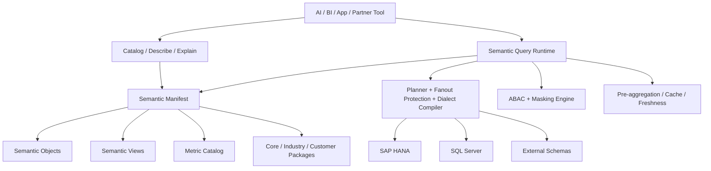

# B1 AI Semantic Layer Architecture

Last refreshed: 2026-06-04

## Scope

This document describes the target **semantic layer architecture** for SAP Business One.
It focuses on governed read, analytics, metadata, lineage, and query behavior.
It does not define Service Layer write/action APIs, although the semantic layer may share identity, policy, and metadata sources with action tooling.

## Why B1 Needs a Semantic Layer

B1 exposes business data through physical tables, views, and OData metadata.
That is enough for technical access, but not enough for AI-ready analytics.

An AI-ready semantic layer should let consumers ask business questions in business terms:

- sales order amount
- open order amount
- document flow
- inventory availability
- customer lifecycle
- AR/AP aging
- price resolution

without forcing them to know:

- `ORDR`, `RDR1`, `OINV`, `INV1`, `OCRD`, `OITM`
- header/line join rules
- dialect differences between HANA and SQL Server
- customer overlays, UDFs, UDTs, and addon tables
- security rules and masking policy details

## Design Principles

1. **One logical contract, multiple physical engines**  
   The semantic layer should compile to SQL Server and HANA from one logical model.

2. **Core is fixed, overlays extend it**  
   SAP-owned core packages should stay stable. Industry and customer overlays may extend core objects, views, and metrics, but should not silently rewrite them.

3. **Semantic metadata is product data**  
   Objects, metrics, joins, policies, examples, caveats, and lineage must be discoverable and versioned.

4. **Security lives in the model**  
   ABAC, masking, row/member/metric visibility, and explainable policy filters must be enforced by the runtime.

5. **AI consumes intent, not physical SQL**  
   AI should query semantic objects and metrics, not memorize raw joins or database dialect details.

## Architecture Overview

## Core Architecture Layers

### 1. Semantic Manifest

The semantic manifest is the source of truth.
It should be versioned and machine-readable.

It defines:

- packages and versions
- semantic objects and their grain
- semantic views and exposed members
- metrics and calculation policies
- dimensions and allowed filters/group-bys
- joins and relationship cardinality
- lineage and source tables
- dialect support
- ABAC and masking hooks
- extension metadata for UDF/UDT/addon/external schema
- AI metadata such as labels, synonyms, examples, and caveats

### 2. Semantic Object

A semantic object is a stable business fact or dimension with a declared grain.

Examples:

- `SalesOrderLine`
- `DeliveryLine`
- `ARInvoiceLine`
- `PurchaseOrderLine`
- `InventoryPosition`
- `DocumentFlow`
- `BusinessPartner`
- `Item`
- `JournalEntryLine`

The object should describe what it means, not just where it comes from physically.

### 3. Semantic View

A semantic view is a consumer-facing facade over one or more objects.
It controls exposure, join paths, and field visibility.

Examples:

- `SalesAnalysis`
- `Customer360`
- `InventoryHealth`
- `ARCollectionRisk`
- `PurchaseFulfillment`
- `DocumentFlowAnalysis`

Views should answer: what is safe and coherent for this consumer to query?

### 4. Metric Catalog

Metrics must be defined independently from physical views.

Each metric should declare:

- name and display label
- source object or view
- formula or aggregation
- additive / semi-additive / non-additive behavior
- default time dimension
- supported grains
- supported filters and group-bys
- currency / tax / UOM policy
- lineage and caveats

Examples:

- `sales_order_amount_net`
- `sales_order_amount_gross`
- `open_order_amount`
- `available_inventory_quantity`
- `ar_overdue_amount`
- `gross_margin_rate`

## Runtime Responsibilities

### Query Planner

The planner turns logical metric requests into executable SQL or federated queries.
It must handle:

- join path selection
- fanout avoidance
- multi-fact query planning
- date grain handling
- status filters
- currency, tax, and UOM policy

### Dialect Compiler

The compiler generates target SQL for:

- SAP HANA
- SQL Server

Dialect differences must be hidden from consumers.

### Policy Engine

The policy engine enforces:

- company DB scope
- branch scope
- warehouse scope
- user/role scope
- member-level visibility
- metric-level visibility
- masking rules

Explain output should show which policy filters were applied.

### Cache / Freshness Layer

The runtime should support:

- pre-aggregations
- materialized semantic views
- freshness timestamps
- stale-data warnings
- cache-hit / cache-miss visibility

## Packaging and Overlay Model

### Core Package

`b1-core` contains SAP-owned stable objects, views, and metrics.

### Industry Packages

`b1-industry-*` packages extend the core with vertical-specific semantics:

- manufacturing
- retail
- wholesale
- project business
- service business

### Customer Overlay

Customer overlays can add:

- UDF-backed fields
- UDT and addon tables
- external schemas
- custom views
- custom metrics

Overlay rules:

- may add or hide fields
- may add joins only if validated
- may add metrics and views
- must not silently change core grain or official metric meaning

## Security and Governance

Security should be part of the semantic model, not a prompt-only rule.

Required governance capabilities:

- row-level policies
- member-level policies
- metric-level policies
- masking
- versioning
- package publish / review
- semantic diff
- certification tests
- explainable lineage

## Initial Core Model

The first core model should be small and stable.

| Object | Grain | Responsibility |
| --- | --- | --- |
| `SalesOrderLine` | `ORDR.DocEntry + RDR1.LineNum` | Sales demand, amount, customer, item, warehouse, status |
| `DeliveryLine` | `ODLN.DocEntry + DLN1.LineNum` | Fulfillment and shipment state |
| `ARInvoiceLine` | `OINV.DocEntry + INV1.LineNum` | Revenue, tax, settlement context |
| `PurchaseOrderLine` | `OPOR.DocEntry + POR1.LineNum` | Purchase demand and expected receipt |
| `InventoryPosition` | `ItemCode + WhsCode` | On-hand, committed, ordered, available |
| `DocumentFlow` | Line-to-line edge | Order → delivery → invoice lineage |
| `BusinessPartner` | `CardCode` | Customer/vendor master and lifecycle context |
| `Item` | `ItemCode` | Item master, pricing, UOM, sales/purchase flags |
| `JournalEntryLine` | `OJDT.TransId + JDT1.Line_ID` | Financial postings and period context |

## Metadata and Introspection API

The semantic layer should expose compact discovery APIs.

Recommended API shape:

- `GET /semantic/catalog`
- `GET /semantic/catalog/{object}`
- `POST /semantic/query`
- `POST /semantic/explain`
- `POST /semantic/validate-query`
- `GET /semantic/lineage/{object}`

Metadata should include:

- labels and descriptions
- synonyms
- examples
- allowed filters/group-bys
- package/version info
- security scope
- freshness / cache state
- source lineage

## Acceptance Criteria

The semantic layer is good enough if:

1. AI can query a business object without knowing physical tables.
2. The same logical query works on HANA and SQL Server.
3. Core objects are stable across customer overlays.
4. ABAC and masking are enforced in the runtime.
5. Explain output shows lineage, policies, and freshness.
6. UDF/UDT/addon/external schema extensions can be discovered and governed.
7. Semantic packages can be versioned, diffed, validated, and certified.

## Open Questions

1. Which semantic objects should be SAP-owned core versus industry-owned?
2. Can B1 publish official semantic manifests for both HANA and SQL Server?
3. How should customer overlays declare UDF/UDT and external schema lineage?
4. Which metrics must remain authoritative and versioned globally?
5. What is the minimal metadata set required for AI consumers to use the model safely?

## Related Notes

- [Capability requirements](./B1_AI_SEMANTIC_LAYER_CAPABILITY_REQUIREMENTS.md)
- [Semantic layer research](./research/semantic-layer-architecture.md)
- [AI service-layer and MCP/CLI practices](./research/ai-service-layer-mcp-cli-practices.md)
- [Design questions](./notes/b1-semantic-service-layer-design-questions.md)

