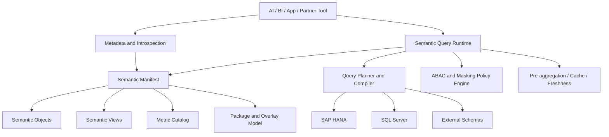

# B1 AI Semantic Layer Capability and Architecture Requirements

Last refreshed: 2026-06-01

## Executive Summary

SAP Business One already exposes rich business data through database tables, views, and OData metadata. However, these raw technical surfaces are not enough for AI, BI, embedded analytics, or partner-built analytical applications.

AI-ready analytics needs a stable semantic layer above physical tables and database-specific SQL. The semantic layer should define business objects, metrics, dimensions, relationships, access policies, lineage, and query behavior in a machine-readable, versioned contract. It should let consumers ask for business concepts such as sales amount, open order value, inventory availability, customer lifecycle, AR aging, document flow, and margin without memorizing SAP B1 table joins, field names, dialect-specific SQL, or customer-specific customizations.

This document focuses only on the **Semantic Layer**. It does not define Service Layer command APIs, document creation workflows, draft posting, or other write/action interfaces.

The requested outcome is a B1 product capability that provides:

- a versioned semantic manifest;
- fixed core semantic objects and views;
- metric definitions with clear business semantics;
- HANA and SQL Server compatibility from one logical contract;
- ABAC, masking, and explainable permission enforcement;
- UDF, UDT, addon table, custom view, custom table, custom metric, and external schema extension support;
- metadata introspection for AI, BI, applications, and partner tooling;
- lineage, explain, freshness, validation, and certification mechanisms.

## Reference Patterns

The target B1 semantic layer should not copy any one platform directly. The useful pattern is to combine the best parts of several mature semantic-layer designs.

| Reference | Useful pattern | B1 semantic layer implication |
| --- | --- | --- |
| Cube.js | Runtime with cubes, views, measures, joins, access policies, pre-aggregations, and meta API. | B1 should provide a governed semantic runtime, not only generated SQL views. |
| dbt Semantic Layer | YAML semantic models, entities, metrics, MetricFlow SQL generation, APIs, and CLI workflows. | B1 should define a versioned semantic manifest and compile logical metric queries into HANA/SQL Server SQL. |
| Looker / LookML | Project/model/view/explore structure, Git-based governance, and curated user-facing query entrypoints. | B1 should separate internal objects from consumer-facing semantic views and package them by core, industry, and customer overlays. |
| Snowflake Semantic Views | Database-level semantic objects with facts, metrics, dimensions, and introspection commands. | B1 should support first-class semantic objects that can be described, validated, shown, queried, and audited. |

### Cube.js Reference Points

Cube's data model distinguishes the underlying graph from consumer-facing facades:

- `cube` represents a data table or logical dataset and defines dimensions, measures, joins, segments, pre-aggregations, and access policies.
- `view` sits on top of cubes and exposes a curated facade to consumers, including selected members and specific join paths.
- `measure` is a named aggregation with its own title, description, visibility, SQL expression, type, and metadata.
- joins include relationship semantics such as one-to-one, one-to-many, and many-to-one.
- multi-fact query planning avoids row multiplication by aggregating facts separately and joining results on shared dimensions.
- access policies can apply row-level, member-level, and masking rules at the model layer.
- pre-aggregations provide performance and cost controls.
- metadata APIs let frontends and AI tools discover available members before querying.

For B1, the key lesson is that semantic views should not merely mirror physical SQL views. They should control the query surface, join path, visibility, governance, and ambiguity boundaries.

### dbt Semantic Layer Reference Points

dbt separates model authoring from query execution:

- semantic models define entities, dimensions, measures, defaults, and joins.
- metrics define reusable business calculations.
- MetricFlow generates SQL from semantic definitions and query requests.
- semantic APIs and CLI tools let downstream consumers discover and query metrics.

For B1, the key lesson is to make the semantic manifest the source of truth. AI should express intent against objects, metrics, dimensions, and filters; the runtime should generate the database-specific SQL.

### Looker / LookML Reference Points

Looker uses project files to govern what users can query:

- views define fields and measures on top of database tables or derived tables.
- models decide which views and explores are exposed to which users.
- explores act as curated query entrypoints.
- projects can be version-controlled and reviewed.

For B1, the key lesson is to provide curated semantic entrypoints. Not every physical table, customer table, or field should be automatically exposed to every consumer.

### Snowflake Semantic Views Reference Points

Snowflake treats semantic views as first-class database objects:

- semantic views can define facts, dimensions, metrics, and relationships.
- they can be created and managed with SQL or YAML.
- metadata can be shown and inspected.
- AI tools can use these semantic definitions to produce governed SQL.

For B1, the key lesson is that semantic objects should be discoverable and inspectable as product-level artifacts, not only hidden implementation files.

## B1 Semantic Layer Target Architecture

The proposed B1 semantic layer has four core model layers plus a runtime and governance system.

### Layer 1: Semantic Manifest

The semantic manifest is the versioned source of truth. It defines:

- semantic packages and versions;
- semantic objects and their grain;
- semantic views and their exposed members;
- metrics and calculation policies;
- dimensions and allowed filters/group-bys;
- joins and relationship cardinality;
- source lineage;
- HANA and SQL Server dialect support;
- ABAC and masking hooks;
- custom UDF, UDT, addon, and external schema extensions;
- metadata for AI and BI consumers.

The manifest should be machine-readable and suitable for validation, diff, testing, and publication.

### Layer 2: Semantic Object

A semantic object is a stable business fact or dimension with a declared grain. Examples:

- `SalesOrderLine`
- `DeliveryLine`
- `ARInvoiceLine`
- `PurchaseOrderLine`
- `InventoryPosition`
- `DocumentFlow`
- `BusinessPartner`
- `Item`
- `JournalEntryLine`

Semantic objects are not automatically identical to physical tables. For example, `SalesOrderLine` may be sourced from `ORDR`, `RDR1`, `OCRD`, `OITM`, `OSLP`, and `OWHS`, but it should expose one stable business grain: one row per sales order line.

### Layer 3: Semantic View

A semantic view is a consumer-facing facade over one or more semantic objects. It should:

- expose only selected members;
- control join paths;
- hide ambiguous or unsafe relationships;
- organize fields into business folders;
- apply view-level visibility and access policies;
- provide labels, descriptions, examples, synonyms, and caveats.

Examples:

- `SalesAnalysis`
- `Customer360`
- `InventoryHealth`
- `ARCollectionRisk`
- `PurchaseFulfillment`
- `DocumentFlowAnalysis`

Semantic views answer the question: "What should a user, AI agent, BI tool, or partner app be allowed to query as a coherent business dataset?"

### Layer 4: Metric Catalog

Metrics should be defined independently from physical views. Each metric should declare:

- metric name and display name;
- source semantic object or view;
- formula or aggregation;
- additive, semi-additive, or non-additive behavior;
- default time dimension;
- supported grains;
- supported filters and group-bys;
- currency policy;
- tax policy;
- UOM policy;
- status inclusion/exclusion rules;
- lineage;
- warnings and business caveats.

Examples:

- `sales_order_amount_net`
- `sales_order_amount_gross`
- `invoice_revenue_net`
- `gross_margin_amount`
- `gross_margin_rate`
- `open_order_amount`
- `available_inventory_quantity`
- `ar_overdue_amount`
- `inventory_turnover_rate`

## Data Layer View Strategy

B1 should support a mixed strategy: fixed core views plus controlled extensions.

| View type | Ownership | Stability | Purpose |
| --- | --- | --- | --- |
| Core semantic views | SAP/B1 official | Stable and versioned | Common B1 analytics across customers. |
| Industry semantic views | SAP/B1 or certified partner | Versioned package | Manufacturing, retail, wholesale, project, service, and other industry variants. |
| Customer semantic views | Customer / implementation partner | Customer overlay | UDF, UDT, addon, custom process, and external schema requirements. |
| Physical implementation views | Runtime / generated / database admin | Internal | Optional physical acceleration or compatibility layer. |

The key rule is:

> Core semantic contracts should be fixed; industry and customer overlays may extend them under explicit version and validation rules.

Customer custom views should not silently override core metric semantics. If a customer changes the meaning of a core metric, the overlay must publish a new metric name or versioned override with visible lineage and caveats.

## Core Capability Requirements

### 1. Semantic Manifest and Package System

**Problem:** B1 metadata is currently scattered across physical tables, OData metadata, views, UDF definitions, addon tables, and partner-specific documentation.

**Required capability:** Provide a versioned semantic manifest and package system. The manifest should support official core packages, industry packages, and customer overlays.

**B1-specific considerations:**

- B1 deployments differ by country, localization, industry, database type, addon footprint, and customer UDF/UDT usage.
- The manifest must represent both standard B1 objects and customer extensions.
- The same manifest shape should work for HANA and SQL Server.

**Acceptance criteria:**

- A consumer can list installed semantic packages and versions.
- A package can declare objects, views, metrics, dimensions, relationships, policies, lineage, and dialect support.
- Customer overlays can extend but not silently break core contracts.
- Manifest validation catches duplicate names, missing lineage, unsupported join paths, and broken metric references.

### 2. Core / Industry / Customer Overlay Model

**Problem:** A single fixed semantic model cannot cover every B1 industry and customer, while a fully free-form model is not governable.

**Required capability:** Support a layered overlay model:

- `b1-core`
- `b1-industry-*`
- `customer-overlay`

**B1-specific considerations:**

- Manufacturing may require production order, BOM, issue/receipt, and variance views.
- Retail may require store, POS, promotion, and stock aging views.
- Wholesale may require customer item codes, price lists, rebates, and warehouse allocation.
- Project businesses may require project, cost center, milestone, WIP, and billing views.

**Acceptance criteria:**

- Core package names and semantics remain stable.
- Industry packages can add views and metrics without forking the core model.
- Customer overlays can add UDF, UDT, custom views, and external tables.
- The runtime can explain which package contributed each object, field, or metric.

### 3. Semantic Object / View / Metric Separation

**Problem:** If semantic views and metrics are bound directly to physical views, the model becomes brittle and hard to extend.

**Required capability:** Separate semantic objects, semantic views, and metrics.

**B1-specific considerations:**

- A single object such as `SalesOrderLine` may support many views and metrics.
- A view such as `SalesAnalysis` may include measures from orders, deliveries, invoices, and returns.
- A metric such as `gross_margin_rate` may require revenue and cost objects and must avoid fanout.

**Acceptance criteria:**

- A metric can be reused across multiple views where valid.
- A semantic view can expose selected fields from multiple objects through explicit join paths.
- The model rejects unsupported object/metric/dimension combinations.
- The manifest declares object grain separately from consumer-facing view names.

### 4. Query Planner and Dialect Compiler

**Problem:** AI and BI consumers should not hand-write SQL for B1 physical tables, and they should not manage HANA vs SQL Server dialect differences.

**Required capability:** Provide a semantic query planner and compiler that turns logical metric queries into executable HANA or SQL Server SQL.

**B1-specific considerations:**

- HANA and SQL Server differ in date functions, quoting, pagination, string conversion, null handling, and SQL syntax.
- B1 facts often require header-line joins and status filters.
- Multi-fact analysis can produce row multiplication if planned naively.

**Acceptance criteria:**

- The same logical semantic query can run on HANA and SQL Server.
- Generated SQL includes source lineage and dialect in explain output.
- The planner handles date grains, join paths, fanout protection, and multi-fact query cases.
- Unsupported combinations are rejected with clear validation messages before execution.

### 5. ABAC, Masking, and Policy Engine

**Problem:** AI queries can expose sensitive data if security is applied outside the semantic model or only in application prompts.

**Required capability:** Define ABAC policies in the semantic layer and enforce them during planning and query execution.

**B1-specific considerations:**

- Policies may depend on company DB, branch, warehouse, salesperson, BP group, project, department, cost center, item group, or user attributes.
- Sensitive fields may include cost, margin, credit limit, bank details, contact information, and employee data.
- Some users may see aggregate metrics but not underlying document-level detail.

**Acceptance criteria:**

- The model supports row-level, member-level, metric-level, and masking rules.
- Policy evaluation is deterministic and not bypassable by custom filters.
- Explain output shows applied policy filters and masked members.
- Test suites can verify permission behavior for different user attributes.

### 6. UDF / UDT / Addon Extension System

**Problem:** Real B1 customers rely heavily on UDFs, UDTs, and addon tables. A semantic layer that ignores them will not fit production usage.

**Required capability:** Provide a formal extension model for custom fields and custom tables.

**B1-specific considerations:**

- UDFs may exist on header tables, line tables, BP master, item master, and other objects.
- UDTs may represent domain entities not known to core B1.
- Addon tables may use custom keys and non-standard naming.

**Acceptance criteria:**

- UDFs can be attached to core semantic objects with labels, types, sensitivity, filter/group/aggregate permissions, and examples.
- UDT/addon tables can declare grain, join key, owner, lineage, freshness, and allowed consumers.
- Custom fields and tables can be included in customer overlays.
- Invalid or ambiguous custom joins fail validation before publication.

### 7. External Schema and Data Federation

**Problem:** Customers may copy CRM, ecommerce, WMS, or other operational data into adjacent schemas and expect analysis across B1 and external data.

**Required capability:** Support controlled federation with external schemas and tables.

**B1-specific considerations:**

- CRM account may need identity mapping to B1 `BusinessPartner`.
- Ecommerce SKU may need mapping to B1 `Item`.
- External data freshness and ownership may differ from B1 data.
- Cross-schema joins may have performance and security implications.

**Acceptance criteria:**

- External tables can be registered in customer overlays.
- Each external object declares source schema, owner, grain, freshness, identity mapping, and security policy.
- Only approved external joins can be used in semantic views.
- Query explain identifies external sources and freshness timestamps.

### 8. Metadata and Introspection API

**Problem:** AI and BI consumers need to discover available objects, metrics, dimensions, filters, joins, caveats, and permissions before querying.

**Required capability:** Provide metadata introspection for semantic consumers.

**B1-specific considerations:**

- Metadata must be compact enough for AI use.
- Metadata must include business descriptions, synonyms, examples, safe defaults, and caveats.
- Domain-specific metadata packs should be available for sales, purchasing, inventory, finance, production, and master data.

**Acceptance criteria:**

- Consumers can list semantic objects, views, metrics, dimensions, filters, and packages.
- Consumers can describe a single object, view, or metric.
- Metadata includes visibility after policy evaluation.
- AI-facing metadata can be requested by domain to avoid oversized contexts.

### 9. Explain, Lineage, and Evidence

**Problem:** Business users and auditors need to understand how a semantic answer was produced.

**Required capability:** Provide explain and lineage outputs for every semantic query.

**B1-specific considerations:**

- B1 users often need to trace metrics back to documents, document lines, journals, warehouses, or master data.
- Custom UDF/UDT/addon fields need explicit source attribution.
- Currency, tax, UOM, status, and cancellation policies affect trust.

**Acceptance criteria:**

- Explain output includes selected semantic view, objects, metrics, filters, policies, source tables, dialect, generated SQL, and cache/freshness details.
- Metric lineage identifies formula, source fields, joins, and package source.
- Results can include warnings for currency, tax, UOM, status, or freshness caveats.
- Consumers can trace aggregate metrics to valid drilldown dimensions where permissions allow.

### 10. Cache, Pre-Aggregation, and Freshness

**Problem:** AI and BI workflows require interactive performance, but direct analytical queries over B1 production databases may be slow or expensive.

**Required capability:** Support cache and pre-aggregation definitions in the semantic model.

**B1-specific considerations:**

- Some metrics should be near real-time; others can be refreshed hourly, daily, or after period close.
- Accounting periods, canceled documents, and reposting can affect metric stability.
- Inventory and AR aging may need explicit freshness timestamps.

**Acceptance criteria:**

- Metrics and views can declare caching/pre-aggregation eligibility.
- Refresh policy and freshness are visible in metadata and query results.
- Query explain says whether data came from live source, materialized view, or cache.
- Stale or partially refreshed data produces explicit warnings.

### 11. Test and Certification Suite

**Problem:** Semantic models can drift as fields, joins, customizations, or metrics change.

**Required capability:** Provide semantic validation, regression testing, and certification.

**B1-specific considerations:**

- HANA and SQL Server results must match for the same logical query.
- Customer overlays must not break core package assumptions.
- UDF/UDT/addon joins can introduce fanout or invalid grain.

**Acceptance criteria:**

- The suite includes grain tests, metric snapshot tests, dialect parity tests, ABAC tests, masking tests, extension validation tests, and query explain golden tests.
- Packages must pass validation before publication.
- Breaking changes are identified by semantic diff.
- Certified packages expose compatibility metadata.

### 12. Governance, Versioning, and Publishing

**Problem:** Without governance, semantic layers become a collection of undocumented local patches.

**Required capability:** Provide a formal governance and publishing workflow for semantic packages.

**B1-specific considerations:**

- SAP/B1 may own core packages.
- Certified partners may publish industry packages.
- Customers and implementation partners may maintain overlays.
- AI-generated model suggestions should not directly publish to production.

**Acceptance criteria:**

- Packages have owners, versions, changelogs, compatibility metadata, and publication status.
- Metric changes require review and tests.
- Consumers can query package versions and object provenance.
- Deprecated objects or metrics have migration guidance.

## Standard Core Model

The first B1 semantic layer should include a small, stable core model rather than trying to cover all B1 tables.

| Core object | Proposed grain | Responsibility |
| --- | --- | --- |
| `SalesOrderLine` | `ORDR.DocEntry + RDR1.LineNum` | Sales order demand, amount, customer, item, warehouse, status, open quantity. |
| `DeliveryLine` | `ODLN.DocEntry + DLN1.LineNum` | Delivery fulfillment, shipment quantity, warehouse, delivery timing. |
| `ARInvoiceLine` | `OINV.DocEntry + INV1.LineNum` | Invoiced revenue, tax, customer, item, settlement context. |
| `PurchaseOrderLine` | `OPOR.DocEntry + POR1.LineNum` | Purchase demand, vendor, item, quantity, expected receipt. |
| `InventoryPosition` | `ItemCode + WhsCode` plus batch/serial where applicable | On hand, committed, ordered, available, warehouse-level position. |
| `DocumentFlow` | Source document line to target document line edge | Order-delivery-invoice-return-credit memo lineage. |
| `BusinessPartner` | `CardCode` | Customer/vendor master, grouping, payment terms, credit, lifecycle dimensions. |
| `Item` | `ItemCode` | Item master, item group, UOM, sales/purchase/inventory flags. |
| `JournalEntryLine` | `OJDT.TransId + JDT1.Line_ID` | Financial postings, account, cost center, project, debit/credit, period. |

The core model should define grain and responsibility first. Detailed field lists can evolve through versioned package metadata.

## Extension Model

### Industry Packages

Industry packages extend the core model without forking it.

Examples:

- Manufacturing: production order, BOM, issue for production, receipt from production, WIP, variance.
- Retail: store, POS transaction, promotion, stock aging, sell-through.
- Wholesale: customer item code, price list, rebates, fulfillment allocation.
- Project-based business: project, milestone, WIP, billing, cost center, contract margin.

### Customer Overlays

Customer overlays support:

- UDFs attached to core objects;
- UDT and addon tables;
- customer-defined semantic views;
- customer-defined metrics;
- external schemas such as CRM, ecommerce, or warehouse systems;
- custom labels, synonyms, examples, and caveats.

### Overlay Rules

Customer overlays may:

- add fields;
- add dimensions;
- add metrics;
- add semantic views;
- add allowed joins;
- hide fields from default exposure;
- add stricter policies.

Customer overlays must not:

- silently change core object grain;
- silently change official metric meaning;
- expose sensitive fields without policy metadata;
- introduce unvalidated many-to-many joins;
- bypass HANA/SQL Server dialect validation.

## Security and Governance

ABAC and governance should be treated as part of the semantic model, not as optional API-layer logic.

### Required Policy Dimensions

B1 semantic policies should support:

- company DB;
- branch;
- warehouse;
- salesperson;
- BP group;
- item group;
- project;
- department;
- cost center;
- account group;
- user role;
- user attributes;
- purpose or consumption mode where applicable.

### Required Protection Modes

| Protection mode | Example |
| --- | --- |
| Row-level filter | Salesperson only sees own customers or orders. |
| Member-level access | User can see sales amount but not margin. |
| Metric-level access | Finance can see gross margin rate; sales can only see revenue. |
| Masking | Contact phone, bank details, or credit limit is masked. |
| Drilldown restriction | User can see aggregate but not document-line details. |

### Governance Workflow

The semantic layer should support:

- package ownership;
- package versioning;
- semantic diff;
- review and approval;
- automated tests;
- publish and rollback;
- deprecation policy;
- compatibility matrix by B1 version, localization, and database type.

## Acceptance Criteria

A B1 semantic layer is acceptable for AI/BI use when the following are true:

1. Consumers can discover official semantic objects, views, metrics, and dimensions without reading physical table documentation.
2. The same logical query can run against HANA and SQL Server.
3. Core business objects declare grain, source lineage, relations, and supported filters/group-bys.
4. Metrics declare formula, additivity, time dimension, currency/tax/UOM policy, and caveats.
5. Core semantic views are stable; industry and customer overlays can extend them under validation rules.
6. ABAC policies are enforced inside the semantic runtime and appear in explain output.
7. UDF, UDT, addon table, custom view, custom table, and custom metric extensions are represented in the manifest.
8. External schema data can be federated only through declared identity mapping, ownership, freshness, and join rules.
9. Query explain includes lineage, generated dialect, applied policy, source objects, cache/freshness, and warnings.
10. Semantic packages pass grain, metric, dialect parity, ABAC, masking, and extension tests before publication.
11. AI-facing metadata can be retrieved by compact domain packs.
12. Deprecated objects, fields, or metrics have versioned migration guidance.

## Open Questions For SAP/B1

1. Will B1 provide official core semantic objects and views, or only metadata for partners to generate them?
2. Can the same logical semantic contract support both HANA and SQL Server?
3. Will B1 expose semantic package versions and compatibility metadata?
4. Can UDF, UDT, addon table, and localization-specific metadata be included in the same manifest shape?
5. Can ABAC, member-level security, masking, and metric-level access be declared in the semantic model?
6. Can B1 provide semantic explain and lineage outputs for generated SQL?
7. Can the semantic layer define pre-aggregation and freshness policies?
8. Can custom external schemas be registered as governed semantic extensions?
9. Can B1 support certified industry packages or a partner package marketplace?
10. Can semantic package validation include HANA/SQL Server parity and policy tests?

## Source References

- Cube documentation: https://cube.dev/docs
- Cube local clone: `docs/architecture-discussions/semantic-service-layer/cubejs`
- dbt Semantic Layer architecture: https://docs.getdbt.com/docs/use-dbt-semantic-layer/sl-architecture
- dbt semantic models: https://docs.getdbt.com/docs/build/semantic-models
- LookML terms and concepts: https://cloud.google.com/looker/docs/lookml-terms-and-concepts
- Snowflake semantic views: https://docs.snowflake.com/en/user-guide/views-semantic/overview
