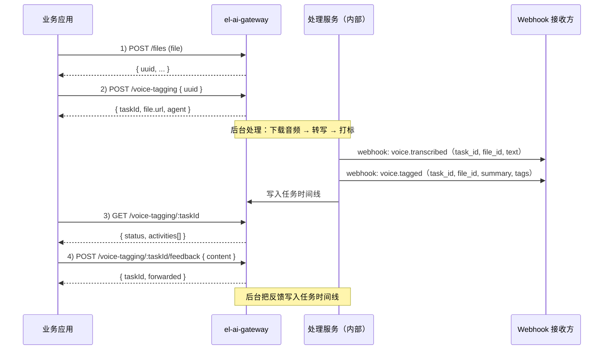

# el-ai-gateway API 文档（语音文件打标签）

雅思兰黛 AI 项目 · 语音文件转写与客户画像打标签业务 API。

- **Base URL（线上）**：`https://ada.alphafina.cn/api/el-ai-gateway`
- **协议**：HTTPS，JSON / multipart
- **版本**：v1

---

## 适用对象

本文面向**对接开发同学**（业务应用 / 集成方）：说明如何调用网关接口、每步拿到什么、如何接收回调、以及各步骤之间怎么衔接。内部实现细节不在此展开。

## 业务场景

把一段**客户语音**（导购/客服与客户的沟通录音）自动处理成**结构化客户画像标签**：

1. 上传语音文件，拿到 `uuid`；
2. 触发处理：**语音转文本** → 按客户画像**多维度打标签**（肤质、诉求、感兴趣产品、购买意向、服务机会、自定义标签…），每条标签都带原文 **evidence**；
3. 处理过程中通过 **webhook** 分两个阶段回调业务系统（转写完成、打标完成）；
4. 业务可**查询任务状态与结果**，并可**回填反馈**（写回任务时间线）。

> 当前转写为 mock（结果里 `mock:true`），接口契约与真实链路一致。

## 整体流程（步骤衔接）



### 步骤衔接（字段怎么传递）

| 步骤 | 产出 | 传给谁 / 用到哪 |
|---|---|---|
| 1 上传 | `uuid` | → 2 发起；也是 webhook 的 `file_id` |
| 2 发起 | `taskId` | → 3 查询、4 反馈；也是 webhook 的 `task_id` |
| 3 查询 | `activities[].markdown` | 转写全文、打标结果、反馈 |
| 4 反馈 | 追加一条 activity | 写入任务时间线 |
| webhook | `voice.transcribed.text` | 业务侧即时拿到转写 |
| webhook | `voice.tagged.summary` / `.tags` | 业务侧消费结构化标签 |

两种典型接法：

- **回调驱动**：业务注册 webhook（见 §7），平台在转写/打标完成时推送；业务用 `task_id` 关联自己的单据。
- **轮询驱动**：业务轮询 `GET /voice-tagging/:taskId`，读 `activities` 里的 Markdown 结果。

---

## 目录

- [适用对象](#适用对象) ｜ [业务场景](#业务场景) ｜ [整体流程（步骤衔接）](#整体流程步骤衔接)

1. [鉴权](#1-鉴权)
2. [通用约定](#2-通用约定)
3. [上传文件](#3-上传文件)
4. [发起打标任务](#4-发起打标任务)
5. [查询任务状态](#5-查询任务状态)
6. [提交反馈](#6-提交反馈)
7. [Webhook 回调（2 次）](#7-webhook-回调2-次)
8. [错误码](#8-错误码)
9. [端到端示例](#9-端到端示例)
10. [查询客户业务标签](#10-查询客户业务标签)
11. [查询任务列表](#11-查询任务列表)

---

## 1. 鉴权

所有业务接口都需要在请求头带平台签发的 API Key：

```
Authorization: Bearer <API_KEY>
```

- 缺失或错误 → `401` `{"code":"UNAUTHORIZED","message":"Missing or invalid API key"}`
- Key 映射到一个租户（tenant），用于数据隔离与任务归属。当前测试租户为 `estee_lauder`。

## 2. 通用约定

- 响应均为 JSON。错误统一信封：
  ```json
  { "code": "UNAUTHORIZED", "message": "Missing or invalid API key" }
  ```
  上游错误会带 `upstream`：
  ```json
  { "code": "UPSTREAM_ERROR", "message": "...", "upstream": { "status": 502, "code": "..." } }
  ```
- **发起/反馈是异步的**：调用立即返回，系统在后台处理并写入任务时间线。请轮询状态接口，或等待 [Webhook 回调](#7-webhook-回调2-次)。
- 当前转写为 **mock**（处理结果里 `mock: true`）。

## 3. 上传文件

上传语音文件，返回文件 `uuid`（后续发起任务用）。

```
POST /files?path=<dir>&fileName=<name>
Content-Type: multipart/form-data
```

| 参数 | 位置 | 必填 | 说明 |
|---|---|---|---|
| `file` | form-data | 是 | 语音文件 |
| `path` | query | 否 | 逻辑目录，如 `voice-tagging` |
| `fileName` | query | 否 | 显示文件名；缺省用上传文件名 |
| `baId` | query | 否 | 业务员（BA）id（并入 `meta.baId`） |
| `customerId` | query | 否 | 关联客户 id（并入 `meta.customerId`） |
| `fileCategory` | query | 否 | 文件分类，如 `raw` |
| `usage` | query | 否 | 用途，如 `voice-tagging` |
| `meta` | query | 否 | 自定义元数据，**URL 编码的 JSON 对象**，如 `{"src":"wms"}` |

- `meta` 会与 `baId`/`customerId` 合并（后两者覆盖同名键），随文件一起保存，可在文件 `GET` 元数据里取回。
- `meta` 非法 JSON 或非对象 → `400 BAD_REQUEST`。

示例：

```bash
curl -X POST "https://ada.alphafina.cn/api/el-ai-gateway/files?path=voice-tagging\
&baId=u_1001&customerId=cus_8899&fileCategory=raw&usage=voice-tagging\
&meta=%7B%22store%22%3A%22XA001%22%7D" \
  -H "Authorization: Bearer <API_KEY>" \
  -F "file=@clip.wav;type=audio/wav"
```

**响应 `200`**（平台文件 receipt）：

```json
{
  "uuid": "471c20082b524316accc1b23cba8a4de",
  "fullPath": "voice-tagging/domain.wav",
  "path": "voice-tagging",
  "filename": "domain.wav",
  "version": 1,
  "sha256": "…",
  "md5": "…",
  "size": 34,
  "mime": "audio/wav",
  "fileCategory": "raw",
  "usage": "voice-tagging",
  "meta": "{\"store\":\"XA001\",\"baId\":\"u_1001\",\"customerId\":\"cus_8899\"}",
  "status": "active",
  "createdBy": "api",
  "createdAt": "2026-09-15T06:13:00.000000",
  "deduplicated": false
}
```

> **衔接**：本接口返回的 `uuid` 是下一步（[发起打标任务](#4-发起打标任务)）的入参；它也是 webhook 里的 `file_id`。

### 3.1 查询文件（按 baId + customerId）

按业务员与客户查询已上传的文件（**两个参数都必填**）。

```
GET /files?baId=<id>&customerId=<id>&path=&q=&recursive=&page=&size=
```

| 参数 | 必填 | 说明 |
|---|---|---|
| `baId` | 是 | 业务员 id |
| `customerId` | 是 | 客户 id |
| `path` | 否 | 目录范围 |
| `q` | 否 | 文件名子串 |
| `recursive` | 否 | 是否含子目录（默认 false） |
| `page` / `size` | 否 | 分页（`page` 1-based；`size` 默认 20，最大 1000） |

**响应 `200`**：

```json
{
  "path": "voice-tagging",
  "recursive": false,
  "query": null,
  "directories": [],
  "files": [
    {
      "uuid": "471c20082b524316accc1b23cba8a4de",
      "fullPath": "voice-tagging/domain.wav",
      "filename": "domain.wav",
      "size": 34,
      "mime": "audio/wav",
      "meta": "{\"baId\":\"u_1001\",\"customerId\":\"cus_8899\"}",
      "status": "active",
      "createdAt": "2026-09-15T06:13:00.000000"
    }
  ],
  "page": 1,
  "size": 20,
  "total": 1,
  "totalPages": 1
}
```

- 过滤条件是 `baId` 与 `customerId` 的**同时精确匹配**。
- 缺 `baId` 或 `customerId` → `400 BAD_REQUEST`。

## 4. 发起打标任务

用上一步的 `uuid` 创建一个打标任务；系统在后台执行**语音转写 + 客户画像打标签**。

```
POST /voice-tagging
Content-Type: application/json
```

```json
{
  "uuid": "471c20082b524316accc1b23cba8a4de",
  "title": "可选，任务名；缺省 Voice tagging: <uuid>",
  "description": "可选",
  "assistantId": "可选，覆盖服务端默认配置"
}
```

**响应 `200`**：

```json
{
  "taskId": "c3915a5a-85ed-4e31-a09e-492b3c11e938",
  "status": "in_progress",
  "file": {
    "uuid": "471c20082b524316accc1b23cba8a4de",
    "url": "https://finademo.tos-s3-cn-beijing.volces.com/estee_lauder/471c2008…?X-Amz-Signature=…"
  },
  "agent": { "dispatched": true }
}
```

- `file.url` 为该文件的限时预签名下载地址。
- `agent.dispatched=true` 表示任务已受理、后台处理中（派发失败不影响本响应）。

> **衔接**：前置是上一步的 `uuid`。返回的 `taskId` 供 [查询状态](#5-查询任务状态) / [提交反馈](#6-提交反馈) 使用；`taskId` 也是 webhook 的 `task_id`。

## 5. 查询任务状态

```
GET /voice-tagging/:taskId
```

**响应 `200`**：

```json
{
  "taskId": "c3915a5a-85ed-4e31-a09e-492b3c11e938",
  "fileId": "471c20082b524316accc1b23cba8a4de",
  "status": "completed",
  "createdAt": "2026-09-15T06:13:00Z",
  "title": "Voice tagging: 471c20082b524316accc1b23cba8a4de",
  "tags": [
    { "tagId": "9ce355bfacca49c4a9e9322a9317c196", "name": "抗老/紧致", "dimension": "concerns" }
  ]
}
```

- `status`：`pending | in_progress | review | failed | interrupted | completed | cancelled`
- `tags`：该任务打出的标签（`tagId` 32 位 hex / `name` / `dimension`）
- 任务不存在 → `404 NOT_FOUND`
- 说明：当前为 **mock 数据**；接入真实任务/标签存储后接口契约不变

> **衔接**：用发起接口返回的 `taskId` 查询；`activities` 会随处理（即 webhook 对应的转写/打标）与反馈而增长。

## 6. 提交反馈

把客户/业务反馈追加到任务时间线。

```
POST /voice-tagging/:taskId/feedback
Content-Type: application/json
```

```json
{
  "content": "客户反馈：purchase_intent 应为「低」，并补充回访建议。",
  "summary": "可选，反馈摘要",
  "assistantId": "可选，覆盖服务端默认配置"
}
```

**响应 `200`**：

```json
{
  "taskId": "c3915a5a-85ed-4e31-a09e-492b3c11e938",
  "forwarded": true,
  "agent": { "dispatched": true }
}
```

随后（约 10–30s）该任务的 `activities` 会多出一条 `## 客户反馈…`。`content` 为空/缺失 → `400 BAD_REQUEST`。

> **衔接**：用发起接口返回的 `taskId`；与"发起"一样是**异步处理**，稍后追加一条 activity，不影响本响应的 `200`。

## 7. Webhook 回调（2 次）

任务处理过程中，平台会向已注册的 **delivery destination** 发起 **2 次** 回调（转写完成、打标完成各一次）。

> 如何准备并**注册回调地址**、实现接收端（含验签代码），见 [WEBHOOK.md](./WEBHOOK.md)。

> **衔接**：回调里的 `task_id` 即"发起"返回的 `taskId`，`file_id` 即"上传"返回的 `uuid`；业务据此把回调关联到自己的单据。

- **投递方式**：Standard Webhooks 签名投递。请求头含 `svix-id`、`svix-timestamp`、`svix-signature`，用注册 destination 时返回的 `whsec_…` 验签。
- **事件类型（`eventType`）**：`job.completed`（两次相同）；**阶段由 body 的 `event` 字段区分**。
- **注册回调地址**：通过平台 Webhook 管理接口注册 destination。

### 7.1 `voice.transcribed`（转写完成）

```json
{"event":"voice.transcribed","stage_status":"success","task_id":"c3915a5a-85ed-4e31-a09e-492b3c11e938","file_id":"471c20082b524316accc1b23cba8a4de","local_path":"/project/audio/471c20082b524316accc1b23cba8a4de","text":"王女士，陕西西安人，老公是上海人，女儿的话呢，现在是在大学里面读大三，学的是和舞台设计有关的。他们是想让女儿去考研的，但是在择校这方面呢是有点小分歧。最近呢也是为了这个考研的那个择校问题。呃，也是有点纠结。然后本人的话呢是很喜欢用我们的呃黑钻光灿面霜，然后之前因为是用过花精粹的面霜，呃，黑钻光灿面霜在天气比较呃，热的时候他会选择，然后冬天的话呢，他还是选择花精粹的面霜比较多一点。呃，之前的话购买的频率是比较高，但最近的话购买频率比较低。呃，一方面是因为他父亲在年头的时候呢过世了，然后他本人呢一直沉浸在这个悲伤中，呃，一直在调整自己，有参加一些呃，公益活动也参加一些，呃，庙里的一些义工的活动。他的日常的话呢，也会发在抖音上面。那抖音上我一直可以看到他有发一些最近的生活。呃，最近的话呢，他因为也是在调理他的，做一些复健。他的腿和他的肩颈一直是有点小问题，所以一直在做调理。那在抖音上呢，我也会一直帮他点赞和问他最近的生活如何。呃，她的话呢，本身呢是一个很有气质的一位女性。如果是参加一些呃酒店的活动，都会是精心打扮的。对我们品牌呢也是比较认可的。而且他的妹妹呢也是用我们雅诗兰黛的，不过用的是我们小棕瓶系列。呃，一直会委托他买，呃，让我帮他去快递给他妹妹。嗯，对我们品牌的认可度还是很高的。","mock":true,"language":"zh-CN","download_ok":true}
```

| 字段 | 类型 | 说明 |
|---|---|---|
| `event` | string | 固定 `voice.transcribed` |
| `stage_status` | string | `success` / `failed` |
| `task_id` | string(uuid) | 任务 id |
| `file_id` | string(32hex) | 文件 uuid |
| `local_path` | string | 转写时的沙盒本地路径 |
| `text` | string | 转写全文 |
| `mock` | boolean | 是否 mock 转写 |
| `language` | string | 语言，如 `zh-CN` |
| `download_ok` | boolean | 音频是否下载成功 |

### 7.2 `voice.tagged`（打标完成）

```json
{"event":"voice.tagged","stage_status":"success","task_id":"c3915a5a-85ed-4e31-a09e-492b3c11e938","file_id":"471c20082b524316accc1b23cba8a4de","mock":true,"summary":"王女士为西安人，雅诗兰黛品牌高认可度客户，偏好黑钻光灿面霜与花精粹面霜，冬季更倾向花精粹。近期因父亲过世情绪低落、购买频率下降，正通过公益与义工活动调整状态，并有腿与肩颈的复健调理需求。女儿在读大三（舞台设计相关）正面临考研择校分歧，可作为情感关怀与回访切入点。","tags":{"skin_type":[],"concerns":[{"tag":"抗老/紧致","evidence":"很喜欢用我们的呃黑钻光灿面霜，然后之前因为是用过花精粹的面霜"},{"tag":"保湿","evidence":"冬天的话呢，他还是选择花精粹的面霜比较多一点"}],"interested_products":[{"tag":"黑钻光灿面霜","evidence":"很喜欢用我们的呃黑钻光灿面霜"},{"tag":"花精粹面霜","evidence":"之前因为是用过花精粹的面霜"},{"tag":"小棕瓶系列","evidence":"他的妹妹呢也是用我们雅诗兰黛的，不过用的是我们小棕瓶系列"}],"purchase_intent":[{"tag":"中","evidence":"对我们品牌的认可度还是很高的；之前的话购买的频率是比较高，但最近的话购买频率比较低"}],"price_sensitivity":[{"tag":"中","evidence":"原文无直接价格表述，仅从高端产品线（黑钻光灿面霜）使用推断"}],"competitor_mentions":[],"service_opportunities":[{"tag":"情感关怀回访","evidence":"他父亲在年头的时候呢过世了，然后他本人呢一直沉浸在这个悲伤中"},{"tag":"健康关怀（腿、肩颈复健调理）","evidence":"他的腿和他的肩颈一直是有点小问题，所以一直在做调理"},{"tag":"抖音互动维护","evidence":"他的日常的话呢，也会发在抖音上面；我也会一直帮他点赞和问他最近的生活如何"},{"tag":"妹妹小棕瓶代购/快递服务","evidence":"一直会委托他买，呃，让我帮他去快递给他妹妹"}],"custom_tags":[{"tag":"西安人","evidence":"王女士，陕西西安人"},{"tag":"老公上海人","evidence":"老公是上海人"},{"tag":"女儿大三（舞台设计相关）","evidence":"女儿的话呢，现在是在大学里面读大三，学的是和舞台设计有关的"},{"tag":"关注女儿考研择校","evidence":"他们是想让女儿去考研的，但是在择校这方面呢是有点小分歧"},{"tag":"雅诗兰黛高认可度","evidence":"对我们品牌呢也是比较认可的；对我们品牌的认可度还是很高的"},{"tag":"抖音活跃","evidence":"他的日常的话呢，也会发在抖音上面"},{"tag":"有气质/注重打扮","evidence":"本身呢是一个很有气质的一位女性。如果是参加一些呃酒店的活动，都会是精心打扮的"},{"tag":"公益/义工活动参与","evidence":"有参加一些呃，公益活动也参加一些，呃，庙里的一些义工的活动"}]}}
```

| 字段 | 类型 | 说明 |
|---|---|---|
| `event` | string | 固定 `voice.tagged` |
| `stage_status` | string | `success` / `failed` |
| `task_id` / `file_id` | string | 任务 id / 文件 uuid |
| `mock` | boolean | 是否 mock |
| `summary` | string | 客户画像摘要 |
| `tags` | object | 多维标签，见下 |

`tags` 各维度均为 `{ "tag": string, "evidence": string }[]`：

| 维度 | 说明 |
|---|---|
| `skin_type` | 肤质 |
| `concerns` | 护肤诉求 |
| `interested_products` | 感兴趣产品 |
| `purchase_intent` | 购买意向 |
| `price_sensitivity` | 价格敏感度 |
| `competitor_mentions` | 竞品提及 |
| `service_opportunities` | 服务/回访机会 |
| `custom_tags` | 自定义标签（地域、家庭、兴趣等） |

## 8. 错误码

| HTTP | code | 说明 |
|---|---|---|
| 401 | `UNAUTHORIZED` | 缺少或错误的 API Key |
| 400 | `BAD_REQUEST` | 参数非法（缺 `uuid` / `content` 为空等） |
| 404 | `NOT_FOUND` | 任务不存在 |
| 413 | `PAYLOAD_TOO_LARGE` | 上传超限 |
| 502 | `UPSTREAM_ERROR` | 上游服务错误 |
| 504 | `UPSTREAM_TIMEOUT` | 上游超时 |
| 500 | `INTERNAL_ERROR` | 其他 |

## 9. 端到端示例

```bash
BASE=https://ada.alphafina.cn/api/el-ai-gateway
KEY=<API_KEY>

# 1) 上传
UUID=$(curl -s -X POST "$BASE/files?path=voice-tagging&fileName=clip.wav" \
  -H "Authorization: Bearer $KEY" \
  -F "file=@clip.wav;type=audio/wav" | jq -r .uuid)

# 2) 发起
TASK=$(curl -s -X POST "$BASE/voice-tagging" \
  -H "Authorization: Bearer $KEY" -H "Content-Type: application/json" \
  -d "{\"uuid\":\"$UUID\"}" | jq -r .taskId)

# 3) 查询状态（转写/打标结果在 activities[].detail.markdown）
curl -s "$BASE/voice-tagging/$TASK" -H "Authorization: Bearer $KEY" | jq

# 4) 反馈
curl -s -X POST "$BASE/voice-tagging/$TASK/feedback" \
  -H "Authorization: Bearer $KEY" -H "Content-Type: application/json" \
  -d '{"content":"客户反馈：purchase_intent 应为低。","summary":"客户修正"}' | jq
```

**时序**：上传 → 发起（立即返回 `taskId`）→ 后台转写+打标（期间发 2 次 webhook：`voice.transcribed`、`voice.tagged`）→ 轮询状态可看到 activity → 反馈再次写入任务时间线。

## 10. 查询客户业务标签

查询某客户的全部业务标签（**标签名称 + 标签 uuid**）。

```
GET /customers/:customerId/tags
```

**响应 `200`**：

```json
{
  "customerId": "cus_8899",
  "total": 3,
  "tags": [
    {
      "tagId": "9ce355bfacca49c4a9e9322a9317c196",
      "name": "抗老/紧致",
      "dimension": "concerns",
      "evidence": "很喜欢用黑钻光灿面霜"
    }
  ]
}
```

| 字段 | 说明 |
|---|---|
| `customerId` | 客户 id |
| `total` | 标签数量 |
| `tags[].tagId` | 标签 uuid（32 位十六进制，如 `9ce355bfacca49c4a9e9322a9317c196`） |
| `tags[].name` | 标签名称 |
| `tags[].dimension` | 维度：`concerns` / `interested_products` / `purchase_intent` / `price_sensitivity` / `service_opportunities` / `custom_tags` 等 |
| `tags[].evidence` | 依据原文（可选） |

- 客户不存在 → `404 NOT_FOUND`。
- 说明：当前为 **mock 数据**（示例客户 `cus_8899`、`cus_1001`）；接入真实标签存储后接口契约不变。

## 11. 查询任务列表（某 BA 某客户）

查询某业务员在某客户下的任务列表，含**文件 id、任务 id、状态、打出的标签**。

```
GET /voice-tagging?baId=<id>&customerId=<id>
```

| 参数 | 必填 | 说明 |
|---|---|---|
| `baId` | 是 | 业务员 id |
| `customerId` | 是 | 客户 id |

**响应 `200`**：

```json
{
  "baId": "ba_001",
  "customerId": "cus_8899",
  "total": 2,
  "tasks": [
    {
      "taskId": "c3915a5a-85ed-4e31-a09e-492b3c11e938",
      "fileId": "471c20082b524316accc1b23cba8a4de",
      "status": "completed",
      "createdAt": "2026-09-15T06:13:00Z",
      "tags": [
        {
          "tagId": "9ce355bfacca49c4a9e9322a9317c196",
          "name": "抗老/紧致",
          "dimension": "concerns"
        }
      ]
    }
  ]
}
```

- 缺 `baId` 或 `customerId` → `400 BAD_REQUEST`。
- 说明：当前为 **mock 数据**（示例组合 `ba_001`+`cus_8899`、`ba_002`+`cus_8899`、`ba_001`+`cus_1001`）；未知组合返回空列表（`total:0`）。
